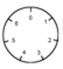
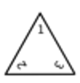
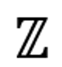

# 第 3 课 补充讲义

常见符号：

$$
\newcommand{\ZZ}{\mathbb{Z}}
\newcommand{\NN}{\mathbb{N}}
\newcommand{\QQ}{\mathbb{Q}}
\newcommand{\RR}{\mathbb{R}}
\newcommand{\CC}{\mathbb{C}}
\newcommand{\intmodcol}{\{\overline{0}_n, \overline{1}_n, \overline{2}_n, \dots, \overline{n-1}_n\}}
$$

| 符号  | 集合                                                                       | 名称                                   |
| :-:   | :--                                                                        | ---                                    |
| $\NN$ | $\{1, 2, 3, \dots\}$                                                       | 自然数  Natural Numbers            |
| $\ZZ$ | $\{0, \pm 1, \pm 2, …\}$                                                   | 整数 Integers                      |
| $\QQ$ | $\{ \frac{m} {n}  \| m, n \in \ZZ, n \neq 0 \}$                            | 有理数 Rational Numbers - Quotient |
| $\RR$ | $\{\pm x_1 x_2 x_3 \dots x_n.y_1 y_2 y_3 \dots\|0 \leq x_i, y_j \leq 9 \}$ | 实数 Real Numbers                  |
| $\CC$ | $\{a+bi \|a, b \in \RR, i^2=-1 \}$                                         | 复数 Complex Numbers               |

其他常见扩展：

| 符号  | 集合                                                                       | 名称                                   |
| :-:   | :--                                                                        | ---                                    |
| $\ZZ[i]$ | $\{a+bi \| a, b \in \ZZ, i^2 = -1\}$ | 高斯整数 Gaussian Integer |
| $\ZZ/n\ZZ$ | $\intmodcol$ | 整数取模 Integers modulo n |
| $\RR^+$     | $\{x \in \RR \mid x > 0\}$                                 | 正实数 Positive real numbers           |
| $\RR^{\ge}$ | $\{x \in \RR \mid x \ge 0\}$                               | 非负实数 Non-negative real numbers     |
| $\ZZ^*$     | $\{n \in \ZZ \mid n \ne 0\}$                               | 非零整数 Non-zero integers             |
| $2\ZZ$     | $\{2n \mid n \in \ZZ\}$                               | 偶整数 Even integers             |
| $\ZZ_n$     | $\{g^n \mid n \in \ZZ\}$                               | 循环群 Cyclic group             |

其他如下本课不再涉及：

- $S_n$: 对称群
- $A_n$: 交错群
- $D_n$: 二面体群
- $Q_n$: 四元数群

|        |   |     |          |
| :-:    | :-:                      | :-:                           | :-:                          |
| 元素   | $\{0, 1, 2,3, 4, 5, 6\}$ | $\{1, r, r^2, f, rf, r^2 f\}$ | $\{0, \pm 1, \pm 2, \dots\}$ |
| 运算符 | +                        | ×                             | +                            |
| 封闭性 | ✅                       | ✅                            | ✅                           |
| 单位元 | 0                        | 1                             | 0                            |
| 逆元   | $x+(-x)=0$               | $x⋅x^{-1}=1$                  | $x+(-x)=0$                   |
| 结合律 | $(a+b)+c=a+(b+c)$        | $(a⋅b)⋅c=a⋅(b⋅c)$             | $(a+b)+c=a+(b+c)$            |

## Cayley Table

$$
\newcommand{\1}{1}
\renewcommand{\i}{\mathcal{i}}
\newcommand{\bfone}{\textbf{1}}
\newcommand{\bfi}{\boldsymbol{\mathcal{i}}}
$$

群：$\times, \{\1, -\1, \i, -\i\}$

| $\times$ | **$\bfone$** | **$-\bfone$** | **$\bfi$** | **$-\bfi$** |
|--------:|------------:|-------------:|---------:|----------:|
| **$\bfone$** | $\1$  | $-\1$  | $\i$  | $-\i$  |
| **$-\bfone$** | $-\1$ | $\1$   | $-\i$ | $\i$   |
| **$\bfi$**   | $\i$   | $-\i$   | $-\1$ | $\1$  |
| **$-\bfi$**  | $-\i$  | $\i$    | $\1$ | $-\1$ |

- 第一行/列与标题一致 (单位元的性质)
- 每一行/列都有单位元 (存在逆元)
- 每一行/列都无重复 (消去律)
- 以对角对称 (符合交换律)

### Order 1

| $\circ$ | e |
| --- | --- |
| e | e |

### Order 2

| $\circ$ | **e** | **a** |
| --- | --- | --- |
| **e** | e | a |
| **a** | a | e |

### Order 3

| $\circ$ | **e** | **a** | **b** |
| --- | --- | --- | --- |
| **e** | e | a | b |
| **a** | a | b | e |
| **b** | b | e | a |

群：$+, \ZZ/3 \ZZ$

| $\circ$ | **0** | **1** | **2** |
| --- | --- | --- | --- |
| **0** | 0 | 1 | 2 |
| **1** | 1 | 2 | 0 |
| **2** | 2 | 0 | 1 |

## 示例

以下是否是群

- $+, \ZZ$ (整数的加法)
- $+, 2\ZZ$ (偶数的加法)
- $+, 2\ZZ+1$ (奇数的加法)
- $\times, \ZZ$ (整数的乘法)
- $+, 7\ZZ$ (7的倍数的加法)
- $+, \ZZ/3\ZZ$ (模3的加法)

答案：
- 是
- 是
- 不是，不封闭(奇数相加等于偶数)，且没有单位元
- 不是，没有逆元（不能除以0）
- 是
- 是

# 循环群

## 循环群的定义
- **定义**：一个群 $G$ 称为循环群，如果存在一个元素 $g \in G$，使得群中的每一个元素都可以写成 $g$ 的某个幂。
  - 形式化：如果 $G = \{ g^k \mid k \in \mathbb{Z} \}$，则 $G$ 是一个循环群。
- **符号**：通常记作 $G = \langle g \rangle$，表示 $G$ 是由 $g$ 生成的。

## 生成元的定义
- **定义**：生成循环群的元素 $g$ 称为生成元。
- **性质**：对于有限群 $G$，如果 $G$ 的阶为 $n$（即 $G$ 中的元素个数），则 $g$ 的幂 $g^n$ 回到单位元 $e$，即 $g^n = e$。

## 示例
- **整数加法群** $(\mathbb{Z}, +)$
  - 1/-1 是唯二的生成元，因为所有整数都可以通过 1/-1 的加法获得（例如，3 = 1 + 1 + 1）。
  - 注意：循环群定义为$G = \{ g^k \mid k \in \mathbb{Z} \}$，其中$k$可以是负数，负数表示取逆元，正整数的逆元就是对应的负整数，因此在生成元为 1 时，例如 -3 = (-1) + (-1) + (-1)。
- **模 $n$ 加法群** $(\mathbb{Z}/n\mathbb{Z}, +)$
  - $1$ 是生成元，因为所有元素 $\{0, 1, 2, \ldots, n-1\}$ 都可以通过 $1$ 的加法循环生成。
- **模 $n$ 乘法群** $((\mathbb{Z}/n\mathbb{Z})^*, \times)$
  - 如果 $n = 7$，群 $(\mathbb{Z}/7\mathbb{Z})^* = \{1, 2, 3, 4, 5, 6\}$ 是循环群（与 $\ZZ^*_7$ 同构），3, 5 是一个生成元：
    - $3^1 \equiv 3 \mod 7$
    - $3^2 \equiv 9 \equiv 2 \mod 7$
    - $3^3 \equiv 3 \times 3^2 \equiv 3 \times 2 \equiv 6 \mod 7$
    - $3^4 \equiv 3 \times 3^3 \equiv 3 \times 6 \equiv 4 \mod 7$
    - $3^5 \equiv 3 \times 3^4 \equiv 3 \times 4 \equiv 5 \mod 7$
    - $3^6 \equiv 3 \times 3^5 \equiv 3 \times 5 \equiv 1 \mod 7$
  - 对于$\ZZ^*_7$我们也可以这样表示：
    - $\langle 2 \rangle = \{2, 2^2, 2^3, \dots\} =\{2,4,1\}=\langle 4 \rangle$
    - $\langle 3 \rangle = \{3, 3^2, 3^3, \dots\} =\{3,2,6,4,5,1\}=\langle 5 \rangle$
    - $\langle 6 \rangle = \{6, 6^2, 6^3, \dots\} =\{6,1\}$

## 循环群的性质
- **唯一性**：在一个循环群中，生成元的幂次唯一地表示群中的每一个元素。
- **周期性**：如果 $G$ 是一个有限群，生成元 $g$ 的周期是 $n$，则 $g^n = e$。
- **子群**：循环群的所有子群也是循环的，并且每个子群的阶是原群阶的约数。

[下载PDF版](assets/AbstractAlgebra.drawio.pdf)