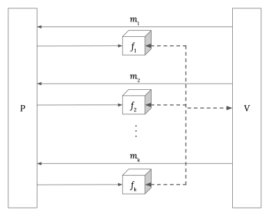
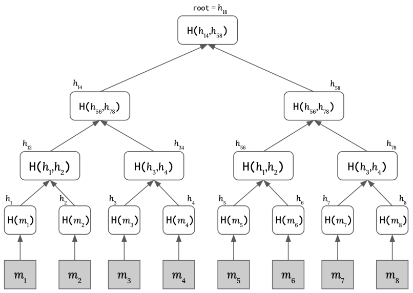

# 第 5 课 补充讲义

现代 SNARK 由两个部分组成：信息论**交互式预言机证明 (IOP)** [1]； 和一个兼容的**密码承诺方案**，它将 IOP“编译”成一个论证系统 [5]。 本讲义介绍几种常用的承诺方案。

IOP 是“信息论的”，因为即使针对 _计算无界_ 的证明者和验证者，它也能提供可靠性和零知识保证。 为了使这成为可能，证明系统做出了“预言机访问”的理想化假设：换句话说，验证者只能通过随机查询访问证明者的消息。

承诺方案使用密码原语（例如单向函数）实例化此预言机访问：因此，由此产生的论证系统仅对于 _计算有界_ 的证明者和验证者而言是安全的。 为了实现 _简洁_ 的论证系统，所选择的承诺方案必须提供相对于被证明的计算而言较低的通信复杂性。

图 1：$k$ 轮交互式预言机证明系统。 在第$i$轮中：验证者$\mathcal{V}$发送消息$m_{i}$给证明者$\mathcal{P}$； 然后，$\mathcal{P}$ 回复消息 $f_{i}$，$\mathcal{V}$ 可以在本轮和所有后续轮次中查询（通过随机访问）。 在 $k$ 轮交互之后，$\mathcal{V}$ 要么接受要么拒绝。

英文原文

Modern SNARKs consist of two components: an information-theoretic interactive oracle proof (IOP) [1]; and a compatible cryptographic commitment scheme, which "compiles" the IOP into an argument system [5]. This note introduces several commonly used commitment schemes.

An IOP is "information-theoretic" in that it provides soundness and zero-knowledge guarantees even when the prover and verifier are computationally unbounded. To make this possible, the proof system makes the idealised assumption of "oracle access": in other words, the verifier can only access the prover's messages through random queries.

The commitment scheme instantiates this oracle access using cryptographic primitives (e.g. a one-way function): as a consequence, the resulting argument system is only secure with respect to a computationally bounded prover and/or verifier. To realise a succinct argument system, the chosen commitment scheme must provide low communication complexity relative to the computation being proven.

Figure 1: A $k$-round interactive oracle proof system. In the $i$-th round: the verifier $\mathcal{V}$ sends a message $m_{i}$ to the prover $\mathcal{P}$; then, $\mathcal{P}$ replies with a message $f_{i}$, which $\mathcal{V}$ can query (via random access) in this and all later rounds. After the $k$ rounds of interaction, $\mathcal{V}$ either accepts or rejects. 

## 正式定义

**定义 1.1**（承诺方案）。 承诺方案是 PPT 算法的元组 $\Gamma=$ (Setup, Commit, Open)，其中：

- $\operatorname{Setup}\left(1^{\lambda}\right) \rightarrow \mathrm{pp}$ 采用安全参数 $\lambda$（一元）并生成公共参数 $\mathrm{pp}$；

- $\operatorname{Commit}(\mathrm{pp} ; m) \rightarrow(C ; r)$ 获取秘密消息 $m$ 并输出公开承诺 $C$ 和（可选）秘密打开提示 $r$（可能为随机数）。

- $\operatorname{Open}(\mathrm{pp}, C ; m, r) \rightarrow b \in\{0,1\}$ 利用打开提示 $r$，验证承诺 $C$ 对消息 $m$ 的打开。

承诺方案 $\Gamma$ 具有**绑定性**，如果对所有 $\mathrm{PPT}$ 对手 $\mathcal{A}$ 而言：

$$
\operatorname{Pr}\left[\begin{array}{ll}
& \mathrm{pp} \leftarrow \operatorname{Setup}\left(1^{\lambda}\right) \\
b_{0}=b_{1} \neq 0 \wedge m_{0} \neq m_{1}: & \left(C, m_{0}, m_{1}, r_{0}, r_{1} \right) \leftarrow \mathcal{A}(\mathrm{pp}) \\
& b_{0} \leftarrow \operatorname{Open}\left(\mathrm{pp}, C, m_{0}, r_{0}\right) \\
& b_{1} \leftarrow \operatorname{Open}\left(\mathrm{pp}, C, m_{1}, r_{1}\right)
\end{array}\right] \leq \operatorname{neg}(\lambda)
$$

通俗来说，这意味着如果没有对手可以生成某个不同的消息 $m_{1}$ 的有效打开并与消息 $m_{0}$ 相对应，则说明消息 $m_{0}$ 与有效承诺 $C$ 具有绑定性。

承诺方案 $\Gamma$ 具有**隐藏性**，如果对于任何多项式时间对手 $\mathcal{A}$ 而言：

$$
\left\vert \operatorname{Pr}\left[\begin{array}{cl}
& \mathrm{pp} \leftarrow \operatorname{Setup}\left(1^{\lambda}\right) \\
& \left(m_{0}, m_{1}, s t\right) \leftarrow \mathcal{A}(\mathrm{pp}) \\
b_{0}=b^{\prime}: & b \stackrel{\$}{\leftarrow}\{0,1\} \\
& \left(C_{b} ; r_{b}\right) \leftarrow \operatorname{Commit}\left(\mathrm{pp} ; m_{b}\right) \\
& b^{\prime} \leftarrow \mathcal{A}\left(\mathrm{pp}, s t, C_{b}\right)
\end{array}\right]-1 / 2 \right\vert=\operatorname{negl}(\lambda)
$$

通俗来说，如果在承诺方案中，没有人能够“逆向工程”以确定到底是哪一条消息被承诺了，那么该承诺具有隐藏性。

::: tip 回忆一下：“上锁的盒子”。 [第3讲：“数学基础构件”]

在汉密尔顿回路示例中，我们使用抗碰撞的哈希函数来构建我们的承诺方案：

- $r \leftarrow\{0,1\}^{256}$ 是输入到哈希函数的随机采样密钥。

- Commit: $\operatorname{hash} (m ; r)=h$。

- Open: 检查 $h \stackrel{?}{=} \operatorname{hash}(m;r)$.

:::

英文原文

Definition 1.1 (Commitment scheme). A commitment scheme is a tuple $\Gamma=$ (Setup, Commit, Open) of PPT algorithms where:

- $\operatorname{Setup}\left(1^{\lambda}\right) \rightarrow \mathrm{pp}$ takes security parameter $\lambda$ (in unary) and generates public parameters $\mathrm{pp}$;

- Commit $(\mathrm{pp} ; m) \rightarrow(C ; r)$ takes a secret message $m$ and outputs a public commitment $C$ and (optionally) a secret opening hint $r$ (which might or might not be the randomness used in the computation).

- Open $(\mathrm{pp}, C ; m, r) \rightarrow b \in\{0,1\}$ verifies the opening of the commitment $C$ to the message $m$ provided with the opening hint $r$.

A commitment scheme $\Gamma$ is binding if for all $\mathrm{PPT}$ adversaries $\mathcal{A}$ :

$$
\operatorname{Pr}\left[\begin{array}{ll} 
& \mathrm{pp} \leftarrow \operatorname{Setup}\left(1^{\lambda}\right) \\
b_{0}=b_{1} \neq 0 \wedge m_{0} \neq m_{1}: & \left(C, m_{0}, m_{1}, r_{0}, r_{1}\right) \leftarrow \mathcal{A}(\mathrm{pp}) \\
& b_{0} \leftarrow \operatorname{Open}\left(\mathrm{pp}, C, m_{0}, r_{0}\right) \\
& b_{1} \leftarrow \operatorname{Open}\left(\mathrm{pp}, C, m_{1}, r_{1}\right)
\end{array}\right] \leq \operatorname{neg}(\lambda)
$$

Informally, this states that a valid commitment $C$ to a message $m_{0}$ is binding if no adversary can produce a valid opening to some different message $m_{1}$.

A commitment scheme $\Gamma$ is hiding if for any polynomial-time adversary $\mathcal{A}$ :

$$
\operatorname{Pr}\left[\begin{array}{cl} 
& \mathrm{pp} \leftarrow \operatorname{Setup}\left(1^{\lambda}\right) \\
& \left(m_{0}, m_{1}, s t\right) \leftarrow \mathcal{A}(\mathrm{pp}) \\
b_{0}=b^{\prime}: & b \stackrel{\$}{\leftarrow}\{0,1\} \\
& \left(C_{b} ; r_{b}\right) \leftarrow \operatorname{Commit}\left(\mathrm{pp} ; m_{b}\right) \\
& b^{\prime} \leftarrow \mathcal{A}\left(\mathrm{pp}, s t, C_{b}\right)
\end{array}\right]-1 / 2 \mid=\operatorname{negl}(\lambda)
$$

Informally, this states that if a commitment is hiding if an adversary cannot "reverse-engineer" which of their messages was committed to.

Recall: "locked boxes". [Lecture 3: "Mathematical Building Blocks"]

In the Hamilton cycle example, we use a collision-resistant hash function to construct our commitment scheme:

- $r \leftarrow\{0,1\}^{256}$ is a randomly sampled secret key that is input to the hash function.

- Commit: hash $(m ; r)=h$.

- Open : check $h \stackrel{?}{=} \operatorname{hash}(m ; r)$. 

## 构造 Constructions

### 向量承诺 Vector commitment scheme

针对消息集 $M$ 的向量承诺方案[2]，即针对向量 $\vec{m}=\left(m_{1}, \ldots, m_{k}\right) \in \mathrm{M}^{k}$ 的承诺方案。向量承诺的主要安全性质是 _位置绑定_ ：

**定义 2.1**（位置绑定）。对于任何 PPT 敌手 $\mathcal{A}$ 来说，向量承诺方案 $\Gamma$ 是**位置绑定的**，如果：

$$
\operatorname{Pr}\left[\begin{array}{l|l}
\text { Open }(\mathrm{pp}, C, \vec{m}, i) \rightarrow 1 \\
\text { Open }(\mathrm{pp}, C, \vec{m^{\prime}}, i) & \mathrm{pp} \stackrel{\$}{\leftarrow} \operatorname{Setup}(1^\lambda) \\
m \neq m^{\prime} & \mathcal{A}(\mathrm{pp}) \rightarrow(c, \vec{m}, \vec{m^{\prime}}, i)
\end{array}\right] \leq \operatorname{negl}(\lambda)
$$

通俗来说，没有任何敌手可以在同一个位置上用两个不同的值打开 $C$。

**向量 Pedersen 承诺**。Pedersen 承诺[9]是一个在消息空间 $\mathbb{F}_{q}$ 上具有绑定性和隐藏性的承诺方案。对于一个秘密消息 $m \in \mathbb{Z}_{q}$：

- Pedersen.Setup $\left(1^{\lambda}, q\right) \rightarrow \mathrm{pp}: \mathrm{pp}=G, H \in \mathbb{G}$，其中 $\mathbb{G}$ 是一个阶为 $q$ 的**群**。

- Pedersen.Commit $(\mathrm{pp} ; m) \rightarrow(C ; r): C=[m] G+[r] H$，其中 $r \in \mathbb{Z}_{q}$ 是一个秘密随机值。

- Pedersen.Open $(\mathrm{pp}, C ; m, r) \rightarrow\{0,1\}:$ 证明者 $\mathcal{P}$ 揭示 $m$ 和 $r$，验证者 $\mathcal{V}$ 检查 $C \stackrel{?}{=}[m] G+[r] H$。

需要注意的是，Pedersen 承诺具有加法同态性：

$$
\begin{aligned}
\operatorname{Commit}(m, r)+\operatorname{Commit}\left(m^{\prime}, r^{\prime}\right) & =[m] G+[r] H+\left[m^{\prime}\right] G+\left[r^{\prime}\right] H \\
& =\left[m+m^{\prime}\right] G+\left[r+r^{\prime}\right] H \\
& =\operatorname{Commit}\left(m+m^{\prime}, r+r^{\prime}\right) .
\end{aligned}
$$

:::tip 练习

证明 Pedersen 承诺方案是具有隐藏性和绑定性的。

请注意，在**群** $\mathbb{G}$ 中，找到一个给定基 $G$ 的群元素 $P$ 的离散对数一般是困难的。换句话说，即难以找到 $x$ 使得 $P=[x] G$。

- **隐藏性**：在给定承诺 $C$ 的情况下，每个值 $m$ 是否均等地有可能成为 $C$ 对应的隐藏值？

- **绑定性**：证明者是否能够找到 $m, m^{\prime}, m \neq m^{\prime}$，使得 $C=$ Pedersen.Commit $(\mathrm{pp} ; m) \wedge \mathbb{C}=$ Pedersen.Commit $\left(\mathrm{pp} ; m^{\prime}\right)$？

:::

我们可以将 Pedersen 承诺方案扩展到消息空间 $\mathbb{F}_{q}^{k}$ 中的向量以得到 VectorPedersen。对于一个消息 $\vec{m}=\left(m_{0}, \ldots, m_{k-1}\right)$：

- VectorPedersen.Setup $\left(1^{\lambda}, q, k\right) \rightarrow \mathrm{pp}: \mathrm{pp}=\left(G_{0}, \ldots, G_{k-1}\right), H \in \mathbb{G}$，其中 $\mathbb{G}$ 是一个阶为 $q$ 的群。

- VectorPedersen.Commit $(\mathrm{pp} ; \vec{m}) \rightarrow(C ; r): C=[r] H+\sum_{i=0}^{k-1}\left[m_{i}\right] G_{i}$，其中 $r \in \mathbb{Z}_{q}$ 是一个秘密随机值。

- VectorPedersen.Open $(\mathrm{pp}, C ; \vec{m}, r) \rightarrow\{0,1\}:$ 证明者 $\mathcal{P}$ 揭示 $m$ 和 $r$，验证者 $\mathcal{V}$ 检查 $C \stackrel{?}{=}[r] H+\sum_{i=0}^{k-1}\left[m_{i}\right] G_{i}$。

:::tip 练习

证明 VectorPedersen 是具有加法同态性，即

$$
\begin{aligned}
& \text { VectorPedersen.Commit }(\mathrm{pp} ; \vec{m})+\text { VectorPedersen.Commit }\left(\mathrm{pp} ; \vec{m^{\prime}}\right) \\
= & \text { VectorPedersen.Commit }\left(\mathrm{pp} ; m+m^{\prime}\right) .
\end{aligned}
$$

:::

**Merkle 树**。一个常用的构建向量承诺的解决方案是 Merkle 树 [8]。它被用于像 Git、Cassandra 和 Bitcoin 这样的分布式系统中用于汇总数据集。Merkle 树也具有隐藏性和可提取性，这些安全特性使它成为在随机预言机模型中将 IOP 编译为非交互式证明的理想选择 [1]。

图 2：Merkle 树的每个内部节点都是其两个子节点的哈希值。

- Merkle.Commit $(\mathrm{pp} ; \vec{m}) \rightarrow C$：对于 $\vec{m}$ 中的每个 $m_{i}$，计算哈希值 $h_{i}=\operatorname{Hash}\left(m_{i}\right)$。计算 Merkle 树的内部节点 $h_{i j}=\operatorname{Hash}\left(h_{i}, h_{j}\right)$。输出 $C=\operatorname{root}=h_{1 q}$。

- Merkle.Open $(\mathrm{pp}, C, \vec{m}, i) \rightarrow b \in\{0,1\}$：

  - a) 证明者 $\mathcal{P}$ 计算从 $h_{i}$ 到根节点的内部节点路径，并得到证据 $\pi=(m_{i}, path)$。

  - b) 验证者 $\mathcal{V}$ 检查根节点是否可以通过将 $m_{i}$ 和路径一起计算哈希得到。

英文原文

A vector commitment scheme [2] for the message space $M$ is a **commitment scheme** for a vector $\vec{m}=\left(m_{1}, \ldots, m_{k}\right) \in \mathrm{M}^{k}$. The main security property for a vector commitment is position binding:

**Definition 2.1** (Position binding). A vector commitment scheme $\Gamma$ is **position binding** if for any PPT adversary $\mathcal{A}$ :

$$
\operatorname{Pr}\left[\begin{array}{l|l}
\text { Open }(\mathrm{pp}, C, \vec{m}, i) \rightarrow 1 \\
\text { Open }(\mathrm{pp}, C, \vec{m^{\prime}}, i) & \mathrm{pp} \stackrel{\$}{\leftarrow} \operatorname{Setup}(1^\lambda) \\
m \neq m^{\prime} & \mathcal{A}(\mathrm{pp}) \rightarrow(c, \vec{m}, \vec{m^{\prime}}, i)
\end{array}\right] \leq \operatorname{negl}(\lambda)
$$

Informally, this states that no adversary can open $C$ to two different values at the same position.

**Vector Pedersen commitment**. The Pedersen commitment [9] is a binding and hiding commitment scheme for the message space $\mathbb{F}_{q}$. For a secret message $m \in \mathbb{Z}_{q}$ :

- Pedersen.Setup $\left(1^{\lambda}, q\right) \rightarrow \mathrm{pp}: \mathrm{pp}=G, H \in \mathbb{G}$, where $\mathbb{G}$ is a **cryptographic group** of order $q$.

- Pedersen.Commit $(\mathrm{pp} ; m) \rightarrow(C ; r): C=[m] G+[r] H$, where $r \in \mathbb{Z}_{q}$ is a random secret.

- Pedersen.Open $(\mathrm{pp}, C ; m, r) \rightarrow\{0,1\}:$ the prover $\mathcal{P}$ reveals $m$ and $r$, and the verifier $\mathcal{V}$ checks $C \stackrel{?}{=}[m] G+[r] H$

Note that the Pedersen commitment is additively homomorphic:

$$
\begin{aligned}
\operatorname{Commit}(m, r)+\operatorname{Commit}\left(m^{\prime}, r^{\prime}\right) & =[m] G+[r] H+\left[m^{\prime}\right] G+\left[r^{\prime}\right] H \\
& =\left[m+m^{\prime}\right] G+\left[r+r^{\prime}\right] H \\
& =\operatorname{Commit}\left(m+m^{\prime}, r+r^{\prime}\right) .
\end{aligned}
$$

::: tip Exercise. Convince yourself that the Pedersen commitment scheme is hiding and binding.

Note that a **cryptographic group** $\mathbb{G}$ is a group where the problem of finding a discrete logarithm of a group element $P$ to a given base $G$ is hard in general. In other words, it is hard to find $x$ such that $P=[x] G$.

- **hiding**: given a commitment $C$, is every value $m$ equally likely to be the value committed in $C ?$

- **binding**: can a prover find $m, m^{\prime}, m \neq m^{\prime}$ such that $C=$ Pedersen.Commit $(\mathrm{pp} ; m) \wedge \mathbb{C}=$ Pedersen.Commit $\left(\mathrm{pp} ; m^{\prime}\right)$ ?

:::

We can extend the Pedersen commitment scheme to get VectorPedersen over vectors in the message space $\mathbb{F}_{q}^{k}$. For a message $\vec{m}=\left(m_{0}, \ldots, m_{k-1}\right)$ :

- VectorPedersen.Setup $\left(1^{\lambda}, q, k\right) \rightarrow \mathrm{pp}: \mathrm{pp}=\left(G_{0}, \ldots, G_{k-1}\right), H \in \mathbb{G}$, where $\mathbb{G}$ is a cryptographic group of $\operatorname{order} q$.

- VectorPedersen.Commit $(\mathrm{pp} ; \vec{m}) \rightarrow(C ; r): C=[r] H+\sum_{i=0}^{k-1}\left[m_{i}\right] G_{i}$, where $r \in \mathbb{Z}_{q}$ is a random secret.

- VectorPedersen.Open $(\mathrm{pp}, C ; \vec{m}, r) \rightarrow\{0,1\}:$ the prover $\mathcal{P}$ reveals $m$ and $r$, and the verifier $\mathcal{V}$ checks $C \stackrel{?}{=}[r] H+\sum_{i=0}^{k-1}\left[m_{i}\right] G_{i}$

::: tip Exercise. Convince yourself that VectorPedersen is additively homomorphic, i.e.

$$
\begin{aligned}
& \text { VectorPedersen.Commit }(\mathrm{pp} ; \vec{m})+\text { VectorPedersen.Commit }\left(\mathrm{pp} ; \vec{m^{\prime}}\right) \\
= & \text { VectorPedersen.Commit }\left(\mathrm{pp} ; m+m^{\prime}\right) .
\end{aligned}
$$

:::

**Merkle tree**. A well-known solution for building vector commitments is a Merkle tree [8]. It is used in distributed systems like Git, Cassandra, and Bitcoin for summarizing sets of data. Merkle trees also have hiding and extractability properties, which make them an ideal candidate for compiling an IOP into a non-interactive proof secure in the random oracle model [1].

Figure 2: Each inner node of a Merkle tree is the hashed value of its two children.

- Merkle.Commit $(\mathrm{pp} ; \vec{m}) \rightarrow C$ : for each $m_{i} \in \vec{m}$, compute a hash $h_{i}=\operatorname{Hash}\left(m_{i}\right)$. Compute the inner nodes of the Merkle tree $h_{i j}=\operatorname{Hash}\left(h_{i}, h_{j}\right)$. Output $C=\operatorname{root}=h_{1 q}$.

- Merkle. Open $(\mathrm{pp}, C, \vec{m}, i) \rightarrow b \in\{0,1\}$ :

a) the prover $\mathcal{P}$ computes the path of inner nodes from $h_{i}$ to root, and $\pi=(m_{i}, path)$;

b) the verifier $\mathcal{V}$ checks that root can be recovered by hashing $m_{i}$ with path. 

### Polynomial commitment scheme

A univariate polynomial commitment scheme is a commitment scheme for the message space $\mathbb{F} \leq d[X]$, the ring of univariate polynomials with maximum degree $d \in \mathbb{N}$ and coefficients in the field $\mathbb{F}=\mathbb{Z}_{p}$

It supports an argument of knowledge for proving the correct evaluation of a committed polynomial at a given point. A lot of information can be encoded in a polynomial: we will see in Lecture 7 ("Arithmetizations") and Lecture 8 ("PlonK and polynomial identities") how an arbitrary relation can be represented as a polynomial.

KZG commitment scheme [6]. This is used in protocols like Sonic [7], Marlin [3], and PlonK [4]. (Marlin and PlonK improve on Sonic by constructing a different polynomial IOP.)

Recall: Pairing-based cryptography. [Lecture 3: "Mathematical Building Blocks"]

Given cyclic groups $\mathbb{G}_{1}, \mathbb{G}_{2}, \mathbb{G}_{T}$, all of the same prime order $p$, a pairing is a nondegenerate bilinear map

$$
e: \mathbb{G}_{1} \times \mathbb{G}_{2} \rightarrow \mathbb{G}_{T}
$$

a) bilinear: $e([a] P,[b] Q)=e(P, Q)^{a \cdot b}$

b) nondegenerate: with generators $G_{1} \in \mathbb{G}_{1}$ and $G_{2} \in \mathbb{G}_{2}, G_{T}:=e\left(G_{1}, G_{2}\right) \in \mathbb{G}_{T}$ is a generator.

In this lecture, we will use the shorthand notation $[x]_{1}:=[x] G_{1},[x]_{2}:=[x] G_{2}$, for any $x \in \mathbb{F}_{p}$.

- KZG.Setup $\left(1^{\lambda}, d\right) \rightarrow$ srs: set srs $=(\mathrm{ck}, \mathrm{vk})=\left(\left\{\left[\alpha^{i}\right]_{1}\right\}_{i=0}^{d-1},[\alpha]_{2}\right) . \alpha$ here is a secret element and must be discarded after the Setup.

- KZG.Commit $(\mathrm{ck} ; f(X)) \rightarrow C:$ for $f(X)=\sum_{i=0}^{n-1} f_{i} X^{i}, C=\sum_{i=0}^{n-1}\left[f_{i}\right]\left[\alpha^{i}\right]_{1}=[f(\alpha)]_{1}$.

- KZG.Open(srs, $C, x, y ; f(X)) \rightarrow\{0,1\}$ : To "open" the commitment at evaluation point $x$ to a claimed value $y$

a) the prover $\mathcal{P}$ computes the quotient polynomial $q(X)=\frac{f(X)-y}{X-x}$ and sends the verifier $\pi=\mathrm{KZG} \cdot$ Commit $($ ck; $q(X))=[q(\alpha)]_{1}$

b) the verifier $\mathcal{V}$ checks $e\left(C-[y]_{1}, H\right) \stackrel{?}{=} e\left(\pi,[\alpha]_{2}-[x]_{2}\right)$.

The a) and b) steps in KZG.Open are often written as two separate algorithms:

- Open $(\mathrm{ck}, C, x, y ; f(X)) \rightarrow \pi$ returns an opening proof for the relation

$$
\mathcal{R}:=\left\{(\mathrm{ck}, C, x, y ; f(X)): \begin{array}{rl} 
& C \operatorname{deg}(f(X)) \leq d \\
& \wedge y=f(x)
\end{array}\right\} ;
$$

- Verify $(\mathrm{vk}, C, x, y, \pi) \rightarrow\{0,1\}$ verifies the opening proof's correctness. 

## Additional resources

This note hopes to serve as a high-level introduction to commitment schemes, and where they fit in the construction of modern SNARKs. Below are a few excellent resources for further understanding and comparing commitment schemes:

### More polynomial commitments

- polynomial commitments: building block for universal SNARKS (Justin Drake): includes a taxonomy of polynomial commitment schemes based on the cryptographic primitives used (hash functions, pairing group, unknown order group, and discrete log group). (Parts $[1],[2]$, and $[3]$.

- KZG polynomial commitments (Dankrad Feist): an introduction to the KZG polynomial commitment scheme, and how to extend it to multiproofs and vector commitments.

- Inner Product Arguments (Dankrad Feist): an introduction to the inner product argument (IPA) protocol, a primitive that can be used to build a polynomial commitment scheme. The IPA is often instantiated with the vector Pedersen commitment scheme.

- bulletproofs: :notes : inner_product_proof excellent write-up on IPA.

- Anatomy of a STARK, Part 3: FRI (Alan Szepieniec): an introduction to the FRI (Fast Reed-Solomon IOP of Proximity) protocol, an oracle proof of proximity. The STARK polynomial IOP instantiates FRI with Merkle trees.

- Linear commitments work over linear functions. (Note that a polynomial commitment is a special form of a linear commitment, since $p(X)=\sum p_{i} x^{i}$ can be written as the dot product of two vectors $\left(p_{0}, \ldots, p_{d-1}\right)$ and $\left(1, x, \ldots, x^{d-1}\right)$.) These are used in constructions like Vortex (lattice-based), Brakedown, and Orion.

- Multilinear commitments work over multivariate linear polynomials. They can be used to instantiate the sumcheck protocol, an interactive proof (IP) which is by itself neither zeroknowledge nor succinct for NP statements. zk-SNARKs which use the sumcheck protocol with multilinear commitment schemes include: Hyrax, Libra, Virgo, and Spartan.

### Implementations and benchmarks

- arkworks-rs/poly-commit: a Rust library supporting four polynomial commitment schemes.

- Polynomial Commitment Benchmark (Remco Bloemen): benchmarks for the Commit algorithm in implementations of KZG, IPA-based, and FRI-based polynomial commitment schemes. 