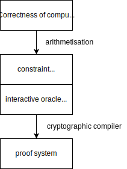
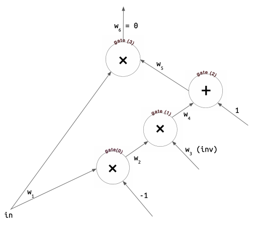

# 第 7 课 补充讲义

算术化是将计算编码为代数约束满足问题的过程。这将检验其正确性的复杂性降低到少量概率代数检查。在证明系统中，算术化的选择会影响IOP的选择范围（见图1）。



图1：证明系统的组成部分。请回顾第5讲（承诺方案）中，承诺方案可用于将交互式预言机证明（IOP）编译成证明系统。

<details>
<summary>英文原文</summary>

Arithmetisation is the encoding of a computation as an algebraic constraint satisfaction problem. This reduces the complexity of verifying its correctness to a few probabilistic algebraic checks. In a proof system, the choice of arithmetisation limits the corresponding range of IOPs that can be used to check it (see Figure 1).



Figure 1: The components of a proof system. Recall from Lecture 3 (Commitment Schemes) that a commitment scheme can be used to compile an interactive oracle proof (IOP) into a proof system.

</details>

## 二次算术程序 (QAPs)

二次算术程序（Quadratic Arithmetic Program，QAP) [9] 是一种将语句转换为多项式上二次方程组的方式。它们可以通过线性交互式证明（LIPs）[10]，代数IOPs [6]，多线性IOPs ([14]，[15]) 进行检验。任何具有乘性复杂度$n$的电路都可以转换为一个 $n$次多项式的QAP。

::: tip 定义1.1. 二次算术程序(QAP)

一个度数为 $d$ 、大小为 $m$ 的二次算术程序$Q$由多项式 $\left\{L_{j}(X)\right\},\left\{R_{j}(X)\right\},\left\{O_{j}(X)\right\}, j \in[0, \ldots, m-1]$ 和一个目标多项式$T(X):=\prod(X-i)_{0=1}^{d-1}$ 组成。当赋值$\left(1, x_{1}, \ldots, x_{m-1}\right)$**满足** $Q$时，

$$
T(X) \mid P(X), P(X):=L(X) \cdot R(X)-O(X)
$$

其中 $L(X):=\sum_{j=0}^{m-1} x_{j} \cdot L_{j}(X), R(X):=\sum_{j=0}^{m-1} x_{j} \cdot R_{j}(X), O(X):=\sum_{j=0}^{m-1} x_{j} \cdot O_{j}(X)$。

:::

<details>
<summary>英文原文</summary>

The Quadratic Arithmetic Program (QAP) [9] is a way to translate statements into a system of quadratic equations over polynomials. They can be checked by linear interactive proofs (LIPs) [10], algebraic IOPs [6], multilinear IOPs ([14], [15]). Any circuit with multiplicative complexity $n$ can be translated to a QAP over degree- $n$ polynomials.

::: tip Definition 1.1. [Quadratic Arithmetic Program (QAP)]

A Quadratic Arithmetic Program Q of degree $d$ and size $m$ consists of polynomials $\left\{L_{j}(X)\right\},\left\{R_{j}(X)\right\},\left\{O_{j}(X)\right\}, j \in[0, \ldots, m-1]$, and a target polynomial $T(X):=\prod(X-i)_{0=1}^{d-1}$ of degree $d$. An assignment $\left(1, x_{1}, \ldots, x_{m-1}\right)$ **satisfies** $Q$ if

$$
T(X) \mid P(X), P(X):=L(X) \cdot R(X)-O(X)
$$

where $L(X):=\sum_{j=0}^{m-1} x_{j} \cdot L_{j}(X), R(X):=\sum_{j=0}^{m-1} x_{j} \cdot R_{j}(X), O(X):=\sum_{j=0}^{m-1} x_{j} \cdot O_{j}(X)$.

:::

</details>

### 一阶约束系统 (R1CS)

算术电路可以用简化形式的一阶约束系统(R1CS)表示，而R1CS则可以转换为QAP。

| 参数系统 | 算术化 | 信息理论协议 | 密码编译器 |
| :---: | :---: | :---: | :---: |
| Groth16 [10] | R1CS | 线性交互证明 (LIP) | 双线性配对 |
| Marlin [6] | R1CS | 代数全息证明 (AHP) | 改进的KZG承诺 |
| Spartan [15] | R1CS | 变体的sumcheck协议 | SPARK |
| Dory [14] | R1CS | 多线性IOP | 双线性配对 |
| Nova [13] | 放宽的R1CS | 多线性IOP | 多线性PCS |

表1：使用R1CS算术化的证明系统的示例。

在第二讲（Circom 1）中，我们看到了`IsZero`电路，它检查给定值是否为零的声明。让我们将`IsZero`转换为一个R1CS电路，然后将其转换为QAP。

```c
template IsZero(){
    signal input in;
    signal output out;

    signal inv;

    inv <−− in != 0 ? 1 / in : 0;

    out <== −in * inv + 1;
    in * out === 0;
}
```

代码1：从`comparators.circom`中获取的`IsZero`电路。



circom的`IsZero`程序可以“展平”为四个约束条件，每个都采用 `左侧 o 右侧 = output` 的形式：


$$
\begin{array}{r}
w_{1} \cdot(-1)=w_{2} \\
w_{2} \cdot w_{3}=w_{4} \\
w_{4}+1=w_{5} \\
w_{1} \cdot w_{5}=w_{6}
\end{array}
$$

在算术电路表示中（左图），每个约束条件对应于一个加法或乘法门。

证明人声称知道一些合法的赋值 $\vec{x}=\left(x_{1}, x_{2}, x_{3}, x_{4}, x_{5}, x_{6}\right)$，使得当将每个值 $a_{i}$ 赋给对应的线路 $w_{i}$，并且 $w_{6}=0$ 时，电路是满足的。对于每个门 $g_{i}$，我们创建三个线路向量 $\overrightarrow{l_{i}}, \vec{r}_{i}, \vec{o}_{i}$，其中包含门中每个变量 $w_{j}$ 的系数。线路向量还包括一个常数项 $w_{0}$ ：

$$
g_0 : w_1 \cdot (-1) = w_2
\;
\left\vert
\;
\begin{aligned}
\begin{array}{cccccccccc}
& & w_0 & w_1 & w_2 & w_3 & w_4 & w_5 & w_6 & \\
\vec{l}_0= & ( & 0 & 1 & 0 & 0 & 0 & 0 & 0 & ) \\
\vec{r}_0= & ( & -1 & 0 & 0 & 0 & 0 & 0 & 0 & ) \\
\vec{o}_0= & ( & 0 & 0 & 1 & 0 & 0 & 0 & 0 & )
\end{array}
\end{aligned}
\right. \;
,
$$

$$
g_1 : w_2 \cdot w_3 = w_4
\;
\left\vert
\;
\begin{aligned}
\begin{array}{cccccccccc}
& & w_0 & w_1 & w_2 & w_3 & w_4 & w_5 & w_6 & \\
\vec{l}_1= & ( & 0 & 0 & 1 & 0 & 0 & 0 & 0 & ) \\
\vec{r}_1= & ( & 0 & 0 & 0 & 1 & 0 & 0 & 0 & ) \\
\vec{o}_1= & ( & 0 & 0 & 0 & 0 & 1 & 0 & 0 & )
\end{array}
\end{aligned}
\right. \;
,
$$

$$
\begin{aligned}
g_2 : w_4 +1 = w_5 \\
(w_4 +1) \cdot 1 = w_5
\end{aligned}

\;
\left\vert
\;
\begin{aligned}
\begin{array}{cccccccccc}
& & w_0 & w_1 & w_2 & w_3 & w_4 & w_5 & w_6 & \\
\vec{l}_2= & ( & 1 & 0 & 0 & 0 & 1 & 0 & 0 & ) \\
\vec{r}_2= & ( & 1 & 0 & 0 & 0 & 0 & 0 & 0 & ) \\
\vec{o}_2= & ( & 0 & 0 & 0 & 0 & 0 & 1 & 0 & )
\end{array}
\end{aligned}
\right. \;
,
$$

$$
g_3 : w_1 \cdot w_5 = w_6
\;
\left\vert
\;
\begin{aligned}
\begin{array}{cccccccccc}
& & w_0 & w_1 & w_2 & w_3 & w_4 & w_5 & w_6 & \\
\vec{l}_3= & ( & 0 & 1 & 0 & 0 & 0 & 0 & 0 & ) \\
\vec{r}_3= & ( & 0 & 0 & 0 & 0 & 0 & 1 & 0 & ) \\
\vec{o}_3= & ( & 0 & 0 & 0 & 0 & 0 & 0 & 1 & )
\end{array}
\end{aligned}
\right. \;
.
$$

现在，我们将每个左边的$l_{i}$线向量收集到矩阵$\mathcal{L}=\left(\overrightarrow{l_{0}}, \overrightarrow{l_{1}}, \overrightarrow{l_{2}}, \overrightarrow{l_{3}}\right)$中，对于右边的$\overrightarrow{r_{i}}$线向量同样如此，而输出$\overrightarrow{o_{i}}$向量也是如此：$\mathcal{R}=\left(\overrightarrow{r_{0}}, \overrightarrow{r_{1}}, \overrightarrow{r_{2}}, \overrightarrow{r_{3}}\right)$，$\mathcal{O}=\left(\overrightarrow{o_{0}}, \overrightarrow{o_{1}}, \overrightarrow{o_{2}}, \overrightarrow{o_{3}}\right)$。

$$
\newcommand{\sp}[1]{\hspace{0.3em} #1 \hspace{0.3em}}
$$

$$
\begin{aligned}
& \mathcal{L}=
\begin{array}{cc}

\begin{array}{cc}

\begin{array}{ccccccc}
w_{0} & w_{1} & w_{2} & w_{3} & w_{4} & w_{5} & w_{6}\\
\end{array}
& \\
\left(\begin{array}{ccccccc}
\sp{0} & \sp{1} & \sp{0} & \sp{0} & \sp{0} & \sp{0} & \sp{0} \\
0 & 0 & 1 & 0 & 0 & 0 & 0 \\
1 & 0 & 0 & 0 & 1 & 0 & 0 \\
0 & 1 & 0 & 0 & 0 & 0 & 0
\end{array}\right)
&
\begin{array}{l}
\vec{l}_{0} \\
\vec{l}_{1} \\
\vec{l}_{2} \\
\vec{l}_{3}
\end{array}
\end{array}
\end{array} \quad ,
\end{aligned}
$$

$$
\begin{aligned}
& \mathcal{R}=
\begin{array}{cc}

\begin{array}{cc}

\begin{array}{ccccccc}
w_{0} & w_{1} & w_{2} & w_{3} & w_{4} & w_{5} & w_{6}\\
\end{array}
& \\
\left(\begin{array}{ccccccc}
\sp{-1} & \sp{0} & \sp{0} & \sp{0} & \sp{0} & \sp{0} & \sp{0} \\
0 & 0 & 0 & 1 & 0 & 0 & 0 \\
1 & 0 & 0 & 0 & 0 & 0 & 0 \\
0 & 0 & 0 & 0 & 0 & 1 & 0
\end{array}\right)
&
\begin{array}{l}
\vec{r}_{0} \\
\vec{r}_{1} \\
\vec{r}_{2} \\
\vec{r}_{3}
\end{array}
\end{array}
\end{array} \quad ,
\end{aligned}
$$

$$
\begin{aligned}
& \mathcal{O}=
\begin{array}{cc}

\begin{array}{cc}

\begin{array}{ccccccc}
w_{0} & w_{1} & w_{2} & w_{3} & w_{4} & w_{5} & w_{6}\\
\end{array}
& \\
\left(\begin{array}{ccccccc}
\sp{0} & \sp{0} & \sp{1} & \sp{0} & \sp{0} & \sp{0} & \sp{0} \\
0 & 0 & 0 & 0 & 1 & 0 & 0 \\
0 & 0 & 0 & 0 & 0 & 1 & 0 \\
0 & 0 & 0 & 0 & 0 & 0 & 1
\end{array}\right)
&
\begin{array}{l}
\vec{o}_{0} \\
\vec{o}_{1} \\
\vec{o}_{2} \\
\vec{o}_{3}
\end{array}
\end{array}
\end{array} \quad .
\end{aligned}
$$

矩阵$\mathcal{L}, \mathcal{R}, \mathcal{O}$和见证向量$\overrightarrow{x}=\left(1, x_{1}, x_{2}, x_{3}, x_{4}, x_{5}, x_{6}\right)$一起构成了IsZero电路的R1CS形式。满足条件的向量$\overrightarrow{x}$可以实现方程$\mathcal{L} \cdot \vec{x}+\mathcal{R} \cdot \vec{x}-\mathcal{O} \cdot \vec{x}=0$。


<details>
<summary>英文原文</summary>

Arithmetic circuits can be expressed a simplified form known as Rank-1 Constraint System (R1CS), which can in turn be transformed into a QAP.


| Argument system | Arithmetization | Information-theoretic protocol | Cryptographic compiler |
| :---: | :---: | :---: | :---: |
| Groth16 [10] | R1CS | linear interactive proof (LIP) | bilinear pairings |
| Marlin [6] | R1CS | algebraic holographic proof (AHP) | adapted KZG commitment |
| Spartan [15] | R1CS | variant of sumcheck protocol | SPARK |
| Dory [14] | R1CS | multilinear IOP | bilinear pairings |
| Nova [13] | Relaxed R1CS | multilinear IOP | multilinear PCS |

Table 1: Examples of proof systems which make use of R1CS arithmetisation.

In Lecture 2 (Circom 1), we saw the Is Zero circuit, which checks a claim about whether a given value is zero. Let's convert Is eero into an R1CS circuit, and then transform it into a QAP.

```c
template IsZero(){
    signal input in;
    signal output out;

    signal inv;

    inv <−− in != 0 ? 1 / in : 0;

    out <== −in * inv + 1;
    in * out === 0;
}
```

Listing 1: The Iszero circuit, taken from comparators. circom in circomlib.


The circom Iszero program can be "flattened" into four constraints, each of the form left o right = output:

$$
\begin{array}{r}
w_{1} \cdot(-1)=w_{2} \\
w_{2} \cdot w_{3}=w_{4} \\
w_{4}+1=w_{5} \\
w_{1} \cdot w_{5}=w_{6}
\end{array}
$$

In the arithmetic circuit representation (left), each of these constraints corresponds to an addition or multiplication gate.

The prover is claiming to know some legal assignment $\vec{x}=\left(x_{1}, x_{2}, x_{3}, x_{4}, x_{5}, x_{6}\right)$, so that when each value $a_{i}$ is assigned to corresponding wire $w_{i}$, and $w_{6}=0$, the circuit is satisfied. For each gate $g_{i}$, we create three wire vectors $\overrightarrow{l_{i}}, \vec{r}_{i}, \vec{o}_{i}$, containing the coefficients of each variable $w_{j}$ at the gate. The wire vectors also include a constant term $w_{0}$ :

$$
g_0 : w_1 \cdot (-1) = w_2
\;
\left\vert
\;
\begin{aligned}
\begin{array}{cccccccccc}
& & w_0 & w_1 & w_2 & w_3 & w_4 & w_5 & w_6 & \\
\vec{l}_0= & ( & 0 & 1 & 0 & 0 & 0 & 0 & 0 & ) \\
\vec{r}_0= & ( & -1 & 0 & 0 & 0 & 0 & 0 & 0 & ) \\
\vec{o}_0= & ( & 0 & 0 & 1 & 0 & 0 & 0 & 0 & )
\end{array}
\end{aligned}
\right. \;
,
$$

$$
g_1 : w_2 \cdot w_3 = w_4
\;
\left\vert
\;
\begin{aligned}
\begin{array}{cccccccccc}
& & w_0 & w_1 & w_2 & w_3 & w_4 & w_5 & w_6 & \\
\vec{l}_1= & ( & 0 & 0 & 1 & 0 & 0 & 0 & 0 & ) \\
\vec{r}_1= & ( & 0 & 0 & 0 & 1 & 0 & 0 & 0 & ) \\
\vec{o}_1= & ( & 0 & 0 & 0 & 0 & 1 & 0 & 0 & )
\end{array}
\end{aligned}
\right. \;
,
$$

$$
\begin{aligned}
g_2 : w_4 +1 = w_5 \\
(w_4 +1) \cdot 1 = w_5
\end{aligned}

\;
\left\vert
\;
\begin{aligned}
\begin{array}{cccccccccc}
& & w_0 & w_1 & w_2 & w_3 & w_4 & w_5 & w_6 & \\
\vec{l}_2= & ( & 1 & 0 & 0 & 0 & 1 & 0 & 0 & ) \\
\vec{r}_2= & ( & 1 & 0 & 0 & 0 & 0 & 0 & 0 & ) \\
\vec{o}_2= & ( & 0 & 0 & 0 & 0 & 0 & 1 & 0 & )
\end{array}
\end{aligned}
\right. \;
,
$$

$$
g_3 : w_1 \cdot w_5 = w_6
\;
\left\vert
\;
\begin{aligned}
\begin{array}{cccccccccc}
& & w_0 & w_1 & w_2 & w_3 & w_4 & w_5 & w_6 & \\
\vec{l}_3= & ( & 0 & 1 & 0 & 0 & 0 & 0 & 0 & ) \\
\vec{r}_3= & ( & 0 & 0 & 0 & 0 & 0 & 1 & 0 & ) \\
\vec{o}_3= & ( & 0 & 0 & 0 & 0 & 0 & 0 & 1 & )
\end{array}
\end{aligned}
\right. \;
,
$$

Now, we collect each of the left $l_{i}$ wire vectors into a matrix $\mathcal{L}=\left(\overrightarrow{l_{0}}, \overrightarrow{l_{1}}, \overrightarrow{l_{2}}, \overrightarrow{l_{3}}\right)$, and likewise for the right $\mathcal{R}=\left(\vec{r}_{0}, \vec{r}_{1}, \vec{r}_{2}, \vec{r}_{3}\right)$ and output $\mathcal{O}=\left(\vec{o}_{0}, \vec{o}_{1}, \vec{o}_{2}, \vec{o}_{3}\right)$ vectors:

$$
\newcommand{\sp}[1]{\hspace{0.3em} #1 \hspace{0.3em}}
$$

$$
\begin{aligned}
& \mathcal{L}=
\begin{array}{cc}

\begin{array}{cc}

\begin{array}{ccccccc}
w_{0} & w_{1} & w_{2} & w_{3} & w_{4} & w_{5} & w_{6}\\
\end{array}
& \\
\left(\begin{array}{ccccccc}
\sp{0} & \sp{1} & \sp{0} & \sp{0} & \sp{0} & \sp{0} & \sp{0} \\
0 & 0 & 1 & 0 & 0 & 0 & 0 \\
1 & 0 & 0 & 0 & 1 & 0 & 0 \\
0 & 1 & 0 & 0 & 0 & 0 & 0
\end{array}\right)
&
\begin{array}{l}
\vec{l}_{0} \\
\vec{l}_{1} \\
\vec{l}_{2} \\
\vec{l}_{3}
\end{array}
\end{array}
\end{array} \quad ,
\end{aligned}
$$

$$
\begin{aligned}
& \mathcal{R}=
\begin{array}{cc}

\begin{array}{cc}

\begin{array}{ccccccc}
w_{0} & w_{1} & w_{2} & w_{3} & w_{4} & w_{5} & w_{6}\\
\end{array}
& \\
\left(\begin{array}{ccccccc}
\sp{-1} & \sp{0} & \sp{0} & \sp{0} & \sp{0} & \sp{0} & \sp{0} \\
0 & 0 & 0 & 1 & 0 & 0 & 0 \\
1 & 0 & 0 & 0 & 0 & 0 & 0 \\
0 & 0 & 0 & 0 & 0 & 1 & 0
\end{array}\right)
&
\begin{array}{l}
\vec{r}_{0} \\
\vec{r}_{1} \\
\vec{r}_{2} \\
\vec{r}_{3}
\end{array}
\end{array}
\end{array} \quad ,
\end{aligned}
$$

$$
\begin{aligned}
& \mathcal{O}=
\begin{array}{cc}

\begin{array}{cc}

\begin{array}{ccccccc}
w_{0} & w_{1} & w_{2} & w_{3} & w_{4} & w_{5} & w_{6}\\
\end{array}
& \\
\left(\begin{array}{ccccccc}
\sp{0} & \sp{0} & \sp{1} & \sp{0} & \sp{0} & \sp{0} & \sp{0} \\
0 & 0 & 0 & 0 & 1 & 0 & 0 \\
0 & 0 & 0 & 0 & 0 & 1 & 0 \\
0 & 0 & 0 & 0 & 0 & 0 & 1
\end{array}\right)
&
\begin{array}{l}
\vec{o}_{0} \\
\vec{o}_{1} \\
\vec{o}_{2} \\
\vec{o}_{3}
\end{array}
\end{array}
\end{array} \quad .
\end{aligned}
$$

The $\mathcal{L}, \mathcal{R}, \mathcal{O}$ matrices, along with our witness vector $\vec{x}=\left(1, x_{1}, x_{2}, x_{3}, x_{4}, x_{5}, x_{6}\right)$, gives the $\mathrm{R} 1 \mathrm{CS}$ form of the Iszero circuit. A satisfying $\vec{x}$ fulfils the equation $\mathcal{L} \cdot \vec{x}+\mathcal{R} \cdot \vec{x}-\mathcal{O} \cdot \vec{x}=0$.

</details>

### R1CS 至 QAP

回顾一下对于度数为$d$，规模为$m$的QAP的定义1.1。我们可以将度数$d$视为约束的数量，将规模$m$视为变量的数量。在我们的例子中，有$d=4, m=7$。通过将R1CS形式转换为QAP形式，我们将我们的检查从三次矩阵乘法降低到了单项式恒等式。

为了将我们的$\mathcal{L}, \mathcal{R}, \mathcal{O}$矩阵转换为$L(X), R(X), O(X)$多项式，让我们检查这些多项式应该具有的属性。在每个变量$j$和门$i$处，我们希望$L_{j}(i)$选择门$g_{i}$的左导线的变量$w_{j}$的系数；$R_{j}(i)$和$O_{j}(i)$同理。换句话说：

$$
L_{j}(i)=\mathcal{L}_{i j}=\vec{l}_{i}[j], R_{j}(i)=\mathcal{R}_{i j}=\vec{r}_{i}[j], O_{j}(i)=\mathcal{O}_{i j}=\vec{o}_{i}[j]
$$

让我们看一下$g_{2}(i=2): w_{4}+1=w_{5}$的门：

$$
\begin{aligned}
L(2) & =x_{0} \cdot L_{0}(2) &&+x_{1} \cdot L_{1}(2) &&+x_{2} \cdot L_{2}(2) &&+x_{3} \cdot L_{3}(2) &&+x_{4} \cdot L_{4}(2) &&+x_{5} \cdot L_{5}(2) &&+x_{6} \cdot L_{6}(2) \\
& =x_{0} \cdot 1 &&+x_{1} \cdot 0 &&+x_{2} \cdot 0 &&+x_{3} \cdot 0 &&+x_{4} \cdot 1 &&+x_{5} \cdot 0 &&+x_{6} \cdot 0 \\
& =x_{0}+x_{4} && =1+x_{4} \text{.}
\end{aligned}
$$

$L(2)$返回$g_{2}$的左导线值。同样地：

$$
\begin{aligned}
R(2) & =x_{0} \cdot R_{0}(2) &&+x_{1} \cdot R_{1}(2) &&+x_{2} \cdot R_{2}(2) &&+x_{3} \cdot R_{3}(2) &&+x_{4} \cdot R_{4}(2) &&+x_{5} \cdot R_{5}(2) &&+x_{6} \cdot R_{6}(2) \\
& =x_{0} \cdot 1 && + x_{1} \cdot 0 && + x_{2} \cdot 0 && + x_{3} \cdot 0 && + x_{4} \cdot 0 && + x_{5} \cdot 0 && + x_{6} \cdot 0 \\
& =x_{0}=1 \text{,}
\end{aligned}
$$

$$
\begin{aligned}
O(2)& =x_{0} \cdot O_{0}(2)&&+x_{1} \cdot O_{1}(2)&&+x_{2} \cdot O_{2}(2)&&+x_{3} \cdot O_{3}(2) \quad&&+x_{4} \cdot O_{4}(2)&&+x_{5} \cdot O_{5}(2)&&+x_{6} \cdot O_{6}(2)\\
& =x_{0} \cdot 0 && + x_{1} \cdot 0 && + x_{2} \cdot 0 && + x_{3} \cdot 0 && + x_{4} \cdot 0 && + x_{5} \cdot 1 && + x_{6} \cdot 0 \\
& =x_{5}
\end{aligned}
$$

因此，$P(2)=L(2) \cdot R(2)-O(2)=\left(1+x_{4}\right) \cdot 1-x_{5}=0 \Longleftrightarrow \mathrm{x}_{0}, \ldots, x_{6}$满足门$g_{2}$。注意，目标多项式$T(X)$的构造是为了在门索引$j \in\{0, \ldots, d-1\}$处为零。换句话说，如果$T(X) \mid P(X)$，那么我们的见证信息$\vec{x}=\left(1, x_{1}, \ldots, x_{6}\right)$在每个门处都满足$P(X)$。

（注意:构造$L_{j}$，我们将每个$L_{j}$设置为在评估点$(0, \ldots, d-1)$列$\mathcal{L}[j]$中的值的插值多项式; $R_{j}$，$O_{j}$同理。）

:::tip 数学基础知识:拉格朗日插值

给定点和评估$\left\{\left(x_{i}, y_{i}\right)\right\}_{i=0}^{d-1}$，我们可以构造一个**插值多项式**$\mathcal{I}(X)$，使$\mathcal{I}\left(x_{i}\right)=y_{i}$:

$$
\mathcal{I}(X):=\sum_{i=0}^{d-1} y_{i} \cdot \mathcal{L}_{i}(X)
$$

其中，$\mathcal{L}_{i}(X)$是穿过评估值 $\left\{x_{0}, \ldots, x_{d-1}\right\}$的拉格朗日基本多项式：

$$
\mathcal{L}_{i}(X):=\prod_{x_{j} \neq x_{i}} \frac{X-x_{j}}{x_{i}-x_{j}}=\left\{\begin{array}{l}
1 \text { if } X=x_{i} \\
0 \text { otherwise }
\end{array}\right.
$$

当评估域为$\{0, \ldots, d-1\}$时，当$X=i$，我们得到$\mathcal{L}_{i}(X)=1$，否则为0。

当评估域为$\left\{\omega^{0}, \ldots, \omega^{n-1}\right\}$时，当$X=\omega^{i}$，我们得到$\mathcal{L}_{i}(X)=1$，否则为0。

:::

QAP算术化引出了验证指数中的等式的协议。由于我们目前只有$k=2$的密码学$k$-线性映射（通过椭圆曲线Pairings实现），因此二次约束是这些协议可以使用的最一般形式。然而，一类单独的算术化使得更灵活的约束格式成为可能，这些约束的次数高于二。下面的三个小节摘自[7]。

| 参数系统  | 算术化 | 信息论协议 | 密码编译器 |
| :---: | :---: | :---: | :---: |
| STARK [2] | AIR | 代数链接IOP<br />（使用FRI作为RS-IOPP） | Merkle树 |
| PlonK [8] | RAP | 多项式IOP | KZG承诺 |
| Halo 2 ([3],[4]) | RAP | 多项式IOP | 内积证明 |

表2: 例子证明系统使用AIR、PAIR和RAP算术化。

<details>
<summary>英文原文</summary>

Recall the definition 1.1 of a QAP of degree $d$ and size $m$. We can think of the degree $d$ as the number of constraints, and the size $m$ as the number of variables. In our example, we have $d=4, m=7$. By converting the R1CS form to a QAP, we have reduced our check from three matrix multiplications to a single polynomial identity.

To convert our $\mathcal{L}, \mathcal{R}, \mathcal{O}$ matrices into $L(X), R(X), O(X)$ polynomials, let's examine the properties these polynomials should have. At each variable $j$ and gate $i$, we want $L_{j}(i)$ to select the coefficient of variable $w_{j}$ at the left wire of gate $g_{i}$; and similarly for $R_{j}(i), O_{j}(i)$. In other words:

$$
L_{j}(i)=\mathcal{L}_{i j}=\vec{l}_{i}[j], R_{j}(i)=\mathcal{R}_{i j}=\vec{r}_{i}[j], O_{j}(i)=\mathcal{O}_{i j}=\vec{o}_{i}[j]
$$

Let's take a look at gate $g_{2}(i=2): w_{4}+1=w_{5}$.

$$
\begin{aligned}
L(2) & =x_{0} \cdot L_{0}(2) && +x_{1} \cdot L_{1}(2) && +x_{2} \cdot L_{2}(2) && +x_{3} \cdot L_{3}(2) && +x_{4} \cdot L_{4}(2) && +x_{5} \cdot L_{5}(2) && +x_{6} \cdot L_{6}(2) \\
& =x_{0} \cdot 1 &&+x_{1} \cdot 0 &&+x_{2} \cdot 0 &&+x_{3} \cdot 0 &&+x_{4} \cdot 1 &&+x_{5} \cdot 0 &&+x_{6} \cdot 0 \\
& =x_{0}+x_{4} && =1+x_{4} \text{.}
\end{aligned}
$$


$L(2)$ returns us the left wire value of $g_{2}$. Similarly:

$$
\begin{aligned}
R(2) & =x_{0} \cdot R_{0}(2) &&+x_{1} \cdot R_{1}(2) &&+x_{2} \cdot R_{2}(2) &&+x_{3} \cdot R_{3}(2) &&+x_{4} \cdot R_{4}(2) &&+x_{5} \cdot R_{5}(2) &&+x_{6} \cdot R_{6}(2) \\
& =x_{0} \cdot 1 && + x_{1} \cdot 0 && + x_{2} \cdot 0 && + x_{3} \cdot 0 && + x_{4} \cdot 0 && + x_{5} \cdot 0 && + x_{6} \cdot 0 \\
& =x_{0}=1 \text{,}
\end{aligned}
$$

$$
\begin{aligned}
O(2)& =x_{0} \cdot O_{0}(2)&&+x_{1} \cdot O_{1}(2)&&+x_{2} \cdot O_{2}(2)&&+x_{3} \cdot O_{3}(2) \quad&&+x_{4} \cdot O_{4}(2)&&+x_{5} \cdot O_{5}(2)&&+x_{6} \cdot O_{6}(2)\\
& =x_{0} \cdot 0 && + x_{1} \cdot 0 && + x_{2} \cdot 0 && + x_{3} \cdot 0 && + x_{4} \cdot 0 && + x_{5} \cdot 1 && + x_{6} \cdot 0 \\
& =x_{5}
\end{aligned}
$$

So $P(2)=L(2) \cdot R(2)-O(2)=\left(1+x_{4}\right) \cdot 1-x_{5}=0 \Longleftrightarrow \mathrm{x}_{0}, \ldots, x_{6}$ fulfil gate $g_{2}$. Notice that the target polynomial $T(X)$ is constructed to evaluate to vanish at the gate indices $j \in\{0, \ldots, d-1\}$. In other words, if $T(X) \mid P(X)$, then our witness $\vec{x}=\left(1, x_{1}, \ldots, x_{6}\right)$ fulfils $P(X)$ at every gate.

(NB: To construct the $L_{j}$ 's, we set each $L_{j}$ to be the interpolation polynomial of the values in column $\mathcal{L}[j]$ at the evaluation points $(0, \ldots, d-1)$; and similarly for the $R_{j}$ 's and $O_{j}$ 's.)

:::tip Math building block: Lagrange interpolation

Given points and evaluations $\left\{\left(x_{i}, y_{i}\right)\right\}_{i=0}^{d-1}$, we can construct an **interpolation polynomial** $\mathcal{I}(X)$ such that $\mathcal{I}\left(x_{i}\right)=y_{i}$ :

$$
\mathcal{I}(X):=\sum_{i=0}^{d-1} y_{i} \cdot \mathcal{L}_{i}(X)
$$

where $\mathcal{L}_{i}(X)$ is the **Lagrange basis polynomial** over the evaluation domain $\left\{x_{0}, \ldots, x_{d-1}\right\}$ :

$$
\mathcal{L}_{i}(X):=\prod_{x_{j} \neq x_{i}} \frac{X-x_{j}}{x_{i}-x_{j}}=\left\{\begin{array}{l}
1 \text { if } X=x_{i} \\
0 \text { otherwise }
\end{array}\right.
$$

When the evaluation domain is $\{0, \ldots, d-1\}$, we get $\mathcal{L}_{i}(X)=1$ if $X=i$, and 0 otherwise.

When the evaluation domain is $\left\{\omega^{0}, \ldots, \omega^{n-1}\right\}$, we get $\mathcal{L}_{i}(X)=1$ if $X=\omega^{i}$, and 0 otherwise.

:::

The QAP arithmetisation induces protocols that verify equations on a secret element in the exponent. Since we currently only have cryptographic $k$-linear maps for $k=2$ (via elliptic curve pairings), quadratic constraints are the most general form that these protocols can work with. However, a separate class of arithmetisations enables a more flexible constraint format, with constraints of degree higher than two. The following three sections are adapted from [7].

| Argument system  | Arithmetization | Information-theoretic protocol | Cryptographic compiler |
| :---: | :---: | :---: | :---: |
| STARK [2] | AIR |  algebraic linking IOP <br /> (uses FRI as RS-IOPP) | Merkle trees |
| PlonK [8] | RAP | polynomial IOP | KZG commitment |
| Halo 2 ([3],[4]) | RAP | polynomial IOP | inner product argument |

Table 2: Examples of proof systems which make use of AIR, PAIR, and RAP arithmetisations.

</details>

## 代数中间表示 (AIR)

代数中间表示（Algebraic Intermediate Representation，AIR）是由一组均匀计算（uniform computations）组成的程序表示。一个在域 $\mathbb{F}$ 上的 AIR $P$ 由一组含有多个变量的约束多项式 $\left\{f_{i}\left(X_{1}, \ldots, X_{2 w}\right)\right\} \in \mathbb{F}^{d}\left[X_{1}, \ldots, X_{2 w}\right]$ 定义。AIR $P$ 的一个执行轨迹 $T$ 由 $n$ 行宽为 $w$ 的元素组成；当且仅当对于任意 $j \in\{1, \ldots, n\}$ 都有 $f_{i}(T[j], T[j+1])=0$，则称 $T$ 为有效执行轨迹。在虚拟机的上下文中，AIR $P$ 验证了 $w$ 个寄存器的 $n$ 个状态转换函数步骤。

:::tip Fibonacci 数列的 AIR

我们可以使用两个状态转换多项式来指定 Fibonacci 数列的 AIR 程序：

$$
\begin{aligned}
f_{1}\left(X_{1}, X_{2}, X_{1}^{\text {next }}, X_{2}^{\text {next }}\right)
& =A^{\text {next }}-(B+A) ; f_{2}\left(X_{1}, X_{2}, X_{1}^{\text {next }}, X_{2}^{\text {next }}\right)\\
& =B^{\text {next }}-\left(B+A^{\text {next }}\right) .
\end{aligned}
$$

例如，我们可以检查在第 $i=2$ 行状态转换是否成立：

$$
\begin{aligned}
& f_{1}\left(X_{1}, X_{2}, X_{1}^{\text {next }}, X_{2}^{\text {next }}\right)=5-(3+2)=0; \\
& f_{2}\left(X_{1}, X_{2}, X_{1}^{\text {next }}, X_{2}^{\text {next }}\right)=8-(5+3)=0. \\
\end{aligned}
$$

| $step$ | $a$ | $b$ |
| :---: | :---: | :---: |
| $i=1$ | 1 | 1 |
| $i=2$ | 2 | 3 |
| $i=3$ | 5 | 8 |
| $i=4$ | 13 | 21 |

练习：你能修改这个程序，使其成为宽度为 3 的 AIR 吗？

:::

:::tip 数学基础

单位根。AIR 将值列 $\vec{v}=\left(v_{1}, \ldots, v_{n}\right)$ 编码为其在求值域 $\left\{\omega, \ldots, \omega^{n}\right\}$ 上的拉格朗日插值多项式，其中 $\omega$ 是阶为 $n$ 的乘法子群中的 $n$ 次单位根：

$$
V(X)=\left\{\begin{array}{l}
\vec{v}[i] \text { when } X=\omega^{i} \\
0 \text { otherwise. }
\end{array}\right.
$$

这让我们通过乘以 $\omega$ 的因子上下移动行。例如：

$$
V^{\text {next }}(X)=V(\omega X), V^{\text {prev }}(X)=V\left(\omega^{-1} X\right) \text {. }
$$

:::

<details>
<summary>英文原文</summary>

An _Algebraic Intermediate Representation (AIR)_ [16] is a representation of a program consisting of _uniform computations_. An AIR $P$ over a field $\mathbb{F}$ is defined by a set of multivariate _constraint polynomials_ $\left\{f_{i}\left(X_{1}, \ldots, X_{2 w}\right)\right\} \in \mathbb{F}^{d}\left[X_{1}, \ldots, X_{2 w}\right]$. An execution trace $T$ for $P$ consists of $n$ rows of width $w ; T$ is a _valid_ execution trace if all $f_{i}(T[j], T[j+1])=0$ for any $j \in\{1, \ldots, n\}$. In the context of a virtual machine, $P$ verifies $n$ steps of a state transition function over $w$ registers.

:::tip AIR for Fibonacci sequence

We can specify an AIR program for the Fibonacci sequence using two state transition polynomials:

$$
\begin{aligned}
f_{1}\left(X_{1}, X_{2}, X_{1}^{\text {next }}, X_{2}^{\text {next }}\right)
& =A^{\text {next }}-(B+A) ; f_{2}\left(X_{1}, X_{2}, X_{1}^{\text {next }}, X_{2}^{\text {next }}\right)\\
& =B^{\text {next }}-\left(B+A^{\text {next }}\right) .
\end{aligned}
$$

As an example, let's check that the state transition holds on row $i=2$ :

$$
\begin{aligned}
& f_{1}\left(X_{1}, X_{2}, X_{1}^{\text {next }}, X_{2}^{\text {next }}\right)=5-(3+2)=0; \\
& f_{2}\left(X_{1}, X_{2}, X_{1}^{\text {next }}, X_{2}^{\text {next }}\right)=8-(5+3)=0. \\
\end{aligned}
$$

| $step$ | $a$ | $b$ |
| :---: | :---: | :---: |
| $i=1$ | 1 | 1 |
| $i=2$ | 2 | 3 |
| $i=3$ | 5 | 8 |
| $i=4$ | 13 | 21 |

Exercise: can you modify this program to make an AIR of width 3? 

:::

:::tip Math building block

Roots of unity. AIR encodes a column of values $\vec{v}=\left(v_{1}, \ldots, v_{n}\right)$ as its Lagrange interpolation polynomial over the evaluation domain $\left\{\omega, \ldots, \omega^{n}\right\}$, where $\omega$ is an $n$-th root of unity in a multiplicative subgroup of order $n$ :

$$
V(X)=\left\{\begin{array}{l}
\vec{v}[i] \text { when } X=\omega^{i} \\
0 \text { otherwise. }
\end{array}\right.
$$

This lets us "shift" up and down rows by multiplying by a factor of $\omega$. For instance:

$$
V^{\text {next }}(X)=V(\omega X), V^{\text {prev }}(X)=V\left(\omega^{-1} X\right) \text {. }
$$

:::

</details>

## 预处理的 AIR (PAIR)

在预处理的AIR（PAIR）中，我们引入了$t$个预定义的列$\left\{c_{i}\right\}_{i=1}^{t} \in \mathbb{F}^{n}$到执行轨迹中，除了由证明者提供的$w$个证明列之外。这些用于向AIR引入非一致性约束条件，通常被称为“选择器”。

:::tip PAIR加法和乘法

让我们构建一个PAIR，在其中对某些行执行加法，对其他行执行乘法。为此，我们定义“加法选择器”$s_{1}$和“乘法选择器”$s_{2}$。约束多项式为：

$$
f\left(X_{1}, X_{2}, X_{1}^{\text {next }}, X_{2}^{\text {next }}\right)=S_{1} \cdot\left(A^{\text {next }}-(A+B)\right)+S_{2} \cdot\left(A^{\text {next }}-A \cdot B\right) .
$$

让我们在$i=1$的行上检查约束条件，仅启用加法操作：

$$
f\left(X_{1}, X_{2}, X_{1}^{\text {next }}, X_{2}^{\text {next }}\right)
=1\cdot(1-(0+1))+0\cdot(1-(0\cdot 1))=0
$$

以及在$i=3$的行上，启用了两个操作：

$$
f\left(X_{1}, X_{2}, X_{1}^{\text {next }}, X_{2}^{\text {next }}\right)
=1\cdot(4-(2+2))+1\cdot(4-(2\cdot 2))=0
$$

| $step$ | $s_1$ | $_2$ | $a$ | $b$ |
| :---: | :---: | :---: | :---: | :---: |
| $i=1$ | 1 | 0 | 0 | 1 |
| $i=2$ | 0 | 1 | 1 | 2 |
| $i=3$ | 1 | 1 | 2 | 2 |
| $i=4$ | 0 | 1 | 4 | 0 |

:::

<details>
<summary>英文原文</summary>

In a _Preprocessed AIR_, or PAIR, we introduce $t$ predefined columns $\left\{c_{i}\right\}_{i=1}^{t} \in \mathbb{F}^{n}$ to the execution trace, in addition to the $w$ witness columns supplied by the prover. These are used to introduce non-uniform constraints to the AIR, and are often referred to as "selectors".

:::tip PAIR for addition and multiplication

Let's construct a PAIR where we perform an addition on some rows, and a multiplication on other rows. For this purpose, we define the "addition selector" $s_{1}$, and the "multiplication selector" $s_{2}$. The constraint polynomial is:

$$
f\left(X_{1}, X_{2}, X_{1}^{\text {next }}, X_{2}^{\text {next }}\right)=S_{1} \cdot\left(A^{\text {next }}-(A+B)\right)+S_{2} \cdot\left(A^{\text {next }}-A \cdot B\right) .
$$

Let's check the constraint on row $i=1$, where only the addition operation is enabled:

$$
f\left(X_{1}, X_{2}, X_{1}^{\text {next }}, X_{2}^{\text {next }}\right)
=1\cdot(1-(0+1))+0\cdot(1-(0\cdot 1))=0
$$

and row $row=3$, where both operations are enabled:

$$
f\left(X_{1}, X_{2}, X_{1}^{\text {next }}, X_{2}^{\text {next }}\right)
=1\cdot(4-(2+2))+1\cdot(4-(2\cdot 2))=0
$$

| $step$ | $s_1$ | $_2$ | $a$ | $b$ |
| :---: | :---: | :---: | :---: | :---: |
| $i=1$ | 1 | 0 | 0 | 1 |
| $i=2$ | 0 | 1 | 1 | 2 |
| $i=3$ | 1 | 1 | 2 | 2 |
| $i=4$ | 0 | 1 | 4 | 0 |

:::

</details>

## 带预处理的随机化 AIR (RAP)

具有预处理的随机AIR（RAP）允许交互轮次引入验证器随机性。在稍后的轮次中，可以将较早轮次的随机性用作约束中的变量。这使得本地约束（相邻行之间）可以检查全局属性。

:::tip RAP用于多重集合相等性

假设我们有一个宽度为2的AIR，并且想要检查一列中的值$\left(a_{1}, \ldots, a_{n}\right)$是否是另一列$\left(b_{1}, \ldots, b_{n}\right)$的完整排列。这称为多重集合相等性检查。仅检查对于均匀随机选择的$\gamma \in \mathbb{F}$

$$
\prod_{i \in[n]}\left(a_{i}+\gamma\right)=\prod_{i \in[n]}\left(b_{i}+\gamma\right) \Longrightarrow \prod_{i \in[n]}\left(a_{i}+\gamma\right) /\left(b_{i}+\gamma\right)=1
$$

为了在两列所有行上检查这个“大乘积”，证明者使用验证器挑战$\gamma$构建运行乘积$\vec{z}=\left(1, z_{1}, \ldots, z_{n}\right)$，其中

$$
z_{i}=\prod_{1 \leq j \leq i}\left(a_{j}+\gamma\right) /\left(b_{j}+\gamma\right)
$$

在最后一行$i=n$，我们所要做的就是检查$z_{n}=\prod_{i \in[n]}\left(a_{i}+\gamma\right) /\left(b_{i}+\gamma\right)=1$。我们还必须在第一行$i=1$上执行一个约束来确保$z_{1}=1$。

练习题：你能写一个仅在行$i=1$上应用的约束吗？（提示：当$i=1$时，$\mathcal{L}_{1}(X)=1$，否则为0; 因此只有在行$i=1$上强制执行一个形如 $\mathcal{L}_{1}(X) \cdot f(X)$ 的约束。）

为了说明多重集合相等性检查，让我们考虑一个$b$只包含$a$中元素移位的示例。为了检查$\vec{z}$是否作为一个运行乘积正确构建，我们将引入一个列$z$到执行跟踪中：

| $步骤$ | $a$ | $b$ | $z$ |
| :---: | :---: | :---: | :---: |
| $i=1$ | $a_{1}$ | $a_{2}$ | 1 |
| $i=2$ | $a_{2}$ | $a_{3}$ | $\frac{\left(a_{1}+\gamma\right)}{\left(a_{2}+\gamma\right)}$ |
| $i=3$ | $a_{3}$ | $a_{1}$ | $\frac{\left(a_{1}+\gamma\right)\left(a_{2}+\gamma\right)}{\left(a_{2}+\gamma\right)\left(a_{3}+\gamma\right)}$ |
| $i=4$ | 0 | 0 | $\frac{\left(a_{1}+\gamma\right)\left(a_{2}+\gamma\right)\left(a_{3}+\gamma\right)}{\left(a_{2}+\gamma\right)\left(a_{3}+\gamma\right)\left(a_{1}+\gamma\right)}$ |

在每个步骤中，我们检查约束

$$
Z^{\text {next }} \cdot(B+\gamma)-Z \cdot(A+\gamma)=0
$$

例如，将其应用于第$i=2$行检查

$$
\frac{\left(a_{1}+\gamma\right)\left(a_{2}+\gamma\right)}{\left(a_{2}+\gamma\right)\left(a_{3}+\gamma\right)} \cdot\left(a_{3}+\gamma\right)-\frac{\left(a_{1}+\gamma\right)}{\left(a_{2}+\gamma\right)} \cdot\left(a_{2}+\gamma\right)=0.
$$

这个检查归纳地检查了$z$是否根据期望积累了$a, b$的乘积。

:::

<details>
<summary>英文原文</summary>

A _Randomised AIR with Preprocessing (RAP)_ allows for rounds of interaction to introduce verifier randomness. In a later round, randomness from the earlier rounds can be used as variables in constraints. This enables _local_ constraints (between adjacent rows) to check global properties.

:::tip RAP for multiset equality

Suppose that we had a width-2 AIR and wanted to check that the values in one column $\left(a_{1}, \ldots, a_{n}\right)$ was a complete permutation of the other $\left(b_{1}, \ldots, b_{n}\right)$. This is called a multiset equality check. It suffices to check that, for a uniformly randomly chosen $\gamma \in \mathbb{F}$

$$
\prod_{i \in[n]}\left(a_{i}+\gamma\right)=\prod_{i \in[n]}\left(b_{i}+\gamma\right) \Longrightarrow \prod_{i \in[n]}\left(a_{i}+\gamma\right) /\left(b_{i}+\gamma\right)=1
$$

To check this "grand product" over all rows of both columns, the prover uses the verifier challenge $\gamma$ to construct a running product $\vec{z}=\left(1, z_{1}, \ldots, z_{n}\right)$, such that

$$
z_{i}=\prod_{1 \leq j \leq i}\left(a_{j}+\gamma\right) /\left(b_{j}+\gamma\right)
$$

At the final row $i=n$, we are left to check that $z_{n}=\prod_{i \in[n]}\left(a_{i}+\gamma\right) /\left(b_{i}+\gamma\right)=1$. We also have to enforce on the first row $i=1$ that $z_{1}=1$.

Exercise: can you write a constraint that applies only on the row $i=1$ ? (Hint: $\mathcal{L}_{1}(X)=1$ when $i=1$, 0 otherwise; so a constraint $\mathcal{L}_{1}(X) \cdot f(X)$ is enforced only on the row $i=1$.) 

To illustrate the multiset equality check, let us consider an example where $b$ simply contains a shift of the elements in $a$. To check that $\vec{z}$ was correctly constructed as a running product, we introduce a column $z$ to the execution trace:

| $step$ | $a$ | $b$ | $z$ |
| :---: | :---: | :---: | :---: |
| $i=1$ | $a_{1}$ | $a_{2}$ | 1 |
| $i=2$ | $a_{2}$ | $a_{3}$ | $\frac{\left(a_{1}+\gamma\right)}{\left(a_{2}+\gamma\right)}$ |
| $i=3$ | $a_{3}$ | $a_{1}$ | $\frac{\left(a_{1}+\gamma\right)\left(a_{2}+\gamma\right)}{\left(a_{2}+\gamma\right)\left(a_{3}+\gamma\right)}$ |
| $i=4$ | 0 | 0 | $\frac{\left(a_{1}+\gamma\right)\left(a_{2}+\gamma\right)\left(a_{3}+\gamma\right)}{\left(a_{2}+\gamma\right)\left(a_{3}+\gamma\right)\left(a_{1}+\gamma\right)}$ |

At each step, we check the constraint

$$
Z^{\text {next }} \cdot(B+\gamma)-Z \cdot(A+\gamma)=0
$$

As an example, applying this on the row $i=2$ checks

$$
\frac{\left(a_{1}+\gamma\right)\left(a_{2}+\gamma\right)}{\left(a_{2}+\gamma\right)\left(a_{3}+\gamma\right)} \cdot\left(a_{3}+\gamma\right)-\frac{\left(a_{1}+\gamma\right)}{\left(a_{2}+\gamma\right)} \cdot\left(a_{2}+\gamma\right)=0.
$$

This inductively checks that $z$ is accumulating the products of $a, b$ as expected.

:::

</details>

## 其他算术化技术

这里未涵盖的一些算术化方法包括：分层算术电路、布尔电路和布尔超立方体。这些方法有时会超出IOP等的信息理论模型，例如“头脑中的多方计算”[12]。在第9讲中，我们将分析选择适当的算术化方法的一些因素。

| 参数系统 | 算术化 | 信息理论协议 | 密码编译器 |
| :---: | :---: | :---: | :---: |
| Virgo [17] | 分层算术电路 | GKR协议IOP | Merkle树 |
| Ligero [1] | 算术电路 | 头脑中MPC，ZKIPCP | Merkle树 |
| BooLigero [11] | 布尔电路 | 头脑中MPC，IOP | Ligero |
| HyperPlonK [5] | 布尔超立方体 | sumcheck协议<br />（多线性IOP）| 多线性PCS |

表3：其他算术化方法的一些示例。

<details>
<summary>英文原文</summary>

Some arithmetisations not covered here include: layered arithmetic circuits, Boolean circuits, and the Boolean hypercube. These sometimes lend themselves to information-theoretic models beyond the IOP, such as MPC-in-the-head [12]. In _Lecture 9 (Proving Systems Stack; Recursion and Proof Composition)_, we will analyse some of the factors that go into picking a suitable arithmetisation.

|  Argument system | Arithmetization | Information-theoretic protocol | Cryptographic compiler |
| :---: | :---: | :---: | :---: |
| Virgo [17] | layered arithmetic circuits | GKR protocol IOP | Merkle tree |
| Ligero [1] | arithmetic circuits | MPC-in-the-head, ZKIPCP | Merkle tree |
| BooLigero [11] | Boolean circuits | MPC-in-the-head, IOP  | Ligero |
| HyperPlonK [5] | Boolean hypercube | sumcheck protocol <br /> (multilinear IOP) | multilinear PCS |

Table 3: Some examples of other arithmetisations.

</details>

## 参考文献

[1] S. Ames, C. Hazay, Y. Ishai, and M. Venkitasubramaniam. Ligero: Lightweight sublinear arguments without a trusted setup. In Proceedings of the 2017 acm sigsac conference on computer and communications security, pages 2087–2104, 2017.

[2] E. Ben-Sasson, I. Bentov, Y. Horesh, and M. Riabzev. Scalable, transparent, and postquantum secure computational integrity. Cryptology ePrint Archive, 2018. [3] S. Bowe, J. Grigg, and D. Hopwood. Recursive proof composition without a trusted setup. Cryptology ePrint Archive, 2019.

[4] S. Bowe, D. Hopwood, and J. Grigg. The halo2 Book: Protocol Description. https: //zcash.github.io/halo2/design/protocol.html, 2020.

[5] B. Chen, B. Bünz, D. Boneh, and Z. Zhang. Hyperplonk: Plonk with linear-time prover and high-degree custom gates. Cryptology ePrint Archive, 2022.

[6] A. Chiesa, Y. Hu, M. Maller, P. Mishra, N. Vesely, and N. Ward. Marlin: preprocessing zkSNARKs with universal and updatable SRS. In Annual International Conference on the Theory and Applications of Cryptographic Techniques, pages 738–768. Springer, 2020.

[7] A. Gabizon. From AIRs to RAPs - how PLONK-style arithmetization works. https://hackmd.io/@aztec-network/plonk-arithmetiization-air, 2020.

[8] A. Gabizon, Z. J. Williamson, and O. Ciobotaru. Plonk: Permutations over lagrange-bases for oecumenical noninteractive arguments of knowledge. Cryptology ePrint Archive, 2019.

[9] R. Gennaro, C. Gentry, B. Parno, and M. Raykova. Quadratic span programs and succinct NIZKs without PCPs. In Annual International Conference on the Theory and Applications of Cryptographic Techniques, pages 626–645. Springer, 2013.

[10] J. Groth. On the size of pairing-based non-interactive arguments. In Annual international conference on the theory and applications of cryptographic techniques, pages 305–326. Springer, 2016.

[11] Y. Gvili, S. Scheffler, and M. Varia. Booligero: improved sublinear zero knowledge proofs for boolean circuits. In International Conference on Financial Cryptography and Data Security, pages 476–496. Springer, 2021.

[12] Y. Ishai, E. Kushilevitz, R. Ostrovsky, and A. Sahai. Zero-knowledge from secure multiparty computation. In Proceedings of the thirty-ninth annual ACM symposium on Theory of computing, pages 21–30, 2007.

[13] A. Kothapalli, S. Setty, and I. Tzialla. Nova: Recursive zero-knowledge arguments from folding schemes. In Advances in Cryptology–CRYPTO 2022: 42nd Annual International Cryptology Conference, CRYPTO 2022, Santa Barbara, CA, USA, August 15–18, 2022, Proceedings, Part IV, pages 359–388. Springer, 2022.

[14] J. Lee. Dory: Efficient, transparent arguments for generalised inner products and polynomial commitments. In Theory of Cryptography Conference, pages 1–34. Springer, 2021.

[15] S. Setty. Spartan: Efficient and general-purpose zkSNARKs without trusted setup. In Annual International Cryptology Conference, pages 704–737. Springer, 2020.

[16] StarkWare. ethSTARK Documentation. Cryptology ePrint Archive, Paper 2021/582, 2021. https://eprint.iacr.org/2021/582.

[17] J. Zhang, T. Xie, Y. Zhang, and D. Song. Transparent polynomial delegation and its applications to zero knowledge proof. In 2020 IEEE Symposium on Security and Privacy (SP), pages 859–876. IEEE, 2020.