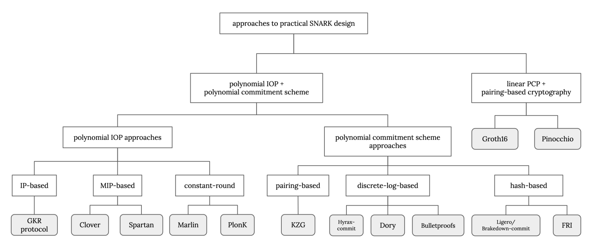
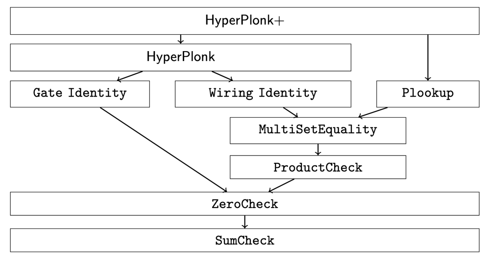
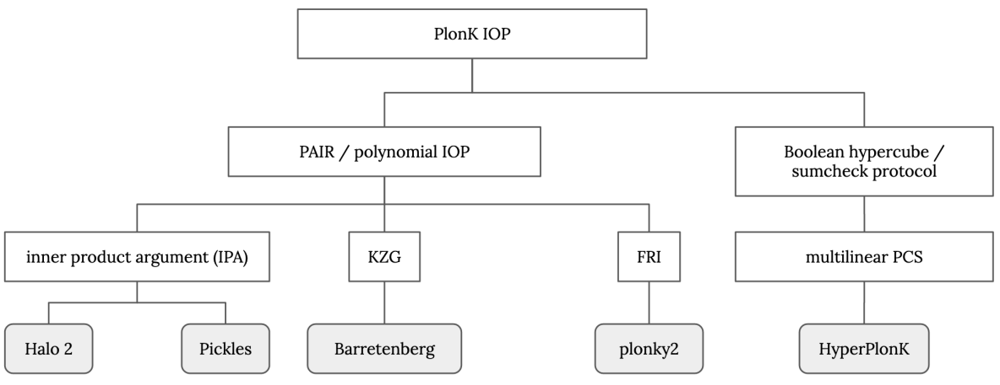

# 第 9 课 补充讲义

本文介绍了一些端到端证明系统的构建方法，并希望开始构建某种分类法。我们简要探讨了递归，这让我们能够使用常量大小的证明来检查任意长的计算链；以及证明组合，其中多个证明系统嵌入到单个协议中。

英文原文

This note illustrates a few more end-to-end constructions of proof systems, with the hope of beginning to construct some kind of taxonomy. We briefly explore recursion, which lets us check an arbitrarily long chain of computation with a constant-size proof; and proof composition, where multiple proof systems are embedded in a single protocol.

## 证明系统分类

大多数现代证明系统都是以模块化方式设计的，使用代数全息证明作为信息论组件。这些是多项式交互式 Oracle 证明 (PIOPs)，其中验证者无法访问被证明关系的完整编码，而是通过 Oracle 访问来进行“查询”。因为 AHP 可以使用任何多项式承诺方案，所以这些证明系统的设置仅特定于所选择的承诺方案，而不是被证明的关系。为了将基于 IOP 的方法与旧方案进行对比，我们通过两个证明系统堆栈，这两个堆栈都从 R1CS 算术化开始：Pinocchio [6] 构建了一个线性概率可检查证明 (LPCP)，然后使用基于配对密码学的编译，而 Marlin [2] 和 Spartan [7] 构建了代数全息证明 (AHPs)，使用多项式承诺方案进行编译。

图 1：现代 SNARKs 的分类法。从 [9] 的图 19.1 改编。

英文原文

Most modern proof systems are designed in a modular way, using _algebraic holographic proofs_ as the information-theoretic component. These are polynomial interactive oracle proofs (PIOPs) where the verifier does not have access to the full encoding of the relation being proven, but instead _queries_ it via oracle access. Because AHPs work with any polynomial commitment scheme, the setups for these proof systems are specific to just the chosen commitment scheme, and not the relation being proven. To contrast the IOP-based approach against older schemes, we go through two proof system stacks that both start with the R1CS arithmetisation: Pinocchio [6] constructs a _linear probabilistically checkable proof_ (LPCP), which is then compiled using pairing-based cryptography, while Marlin [2] and Spartan [7] construct _algebraic holographic proofs_ (AHPs), compiled using a polynomial commitment scheme.

Figure 1: A taxonomy of modern SNARKs. Adapted from Fig. 19.1 of [9].

## R1CS $\rightarrow$ QAP + LPCP + 双线性映射 (Pinocchio)

回顾第7讲（算术化），一个Rank-1约束系统（R1CS）由矩阵$\mathcal{L}, \mathcal{R}, \mathcal{O}$组成。一个满足的赋值$\vec{a}=\left(a_{0}, \ldots, a_{m-1}\right)$满足$\mathcal{L} \cdot \vec{a}+\mathcal{R} \cdot \vec{a}-\mathcal{O} \cdot \vec{a}=\overrightarrow{0}$。

R1CS可以表示为一个二次算术程序（QAP）$Q$，它由多项式$\left\{L_{j}\right\},\left\{R_{j}\right\},\left\{O_{j}\right\}, j \in[m]$和一个目标多项式$T(X)$组成，该多项式在所有$i \in[d]$处求值为零。要检查一个赋值$\vec{a}$是否满足，我们检查

$$
H(X):=P(X) / T(X)
$$

其中：

- $P(X):=L(X) \cdot R(X)-O(X)$检查评估域中的每个点的赋值；
- $L(X):=\sum a_{j} \cdot L_{j}(X), R(X):=\sum a_{j} \cdot R_{j}(X), O(X):=\sum a_{j} \cdot O_{j}(X)$。

:::tip 定义1.1. [线性概率可检验证明（LPCP）]

长度为$m$的线性概率可检验证明（LPCP）是一个计算线性函数$\pi: \mathbb{F}^{m} \rightarrow \mathbb{F}$的oracle；即每个oracle查询$\vec{q}_{i} \in \mathbb{F}^{m}$的答案是$a_{i}=\left\langle\pi, q_{i}\right\rangle$。

:::

英文原文

Recall from Lecture 7 (Arithmetisations) that a Rank-1 Constraint System (R1CS) consists of the matrices $\mathcal{L}, \mathcal{R}, \mathcal{O}$. A satisfying assignment $\vec{a}=\left(a_{0}, \ldots, a_{m-1}\right)$ fulfils $\mathcal{L} \cdot \vec{a}+\mathcal{R} \cdot \vec{a}-\mathcal{O} \cdot \vec{a}=\overrightarrow{0}$.

The R1CS can be expressed as a Quadratic Arithmetic Program (QAP) $Q$, which consists of the polynomials $\left\{L_{j}\right\},\left\{R_{j}\right\},\left\{O_{j}\right\}, j \in[m]$, and a target polynomial $T(X)$ that evaluates to zero at all $i \in[d]$. To check that an assignment $\vec{a}$ is satisfying, we check that

$$
H(X):=P(X) / T(X)
$$

where:

- $P(X):=L(X) \cdot R(X)-O(X)$ checks the assignment at each point in the evaluation domain;
- $L(X):=\sum a_{j} \cdot L_{j}(X), R(X):=\sum a_{j} \cdot R_{j}(X), O(X):=\sum a_{j} \cdot O_{j}(X)$.

:::tip Definition 1.1. [Linear Probabilistically Checkable Proof (LPCP)]

A Linear Probabilistically Checkable Proof (LPCP) of length $m$ is an oracle computing a linear function $\pi: \mathbb{F}^{m} \rightarrow \mathbb{F}$; namely, the answer to each oracle query $\vec{q}_{i} \in \mathbb{F}^{m}$ is $a_{i}=\left\langle\pi, q_{i}\right\rangle$.

:::

### QAP 可除性检查

为了检查QAP的正确性，Pinocchio [6]使用基于配对密码学的LPCP进行编译。在这里，我们使用对称配对$e: \mathbb{G}_{1} \times \mathbb{G}_{1} \rightarrow \mathbb{G}_{T}$，其中$G \in \mathbb{G}_{1}$是一个生成元。我们按照以下步骤检查QAP的可除性：

:::tip QAP可除性检查

- $\operatorname{Setup}\left(\left\{L_{j}\right\},\left\{R_{j}\right\},\left\{O_{j}\right\}, T(X)\right) \rightarrow \operatorname{srs}:$
    - 采样一个随机的评估点$s$；
    - 输出QAP的多项式在$s$处的评估的承诺：

    $$
    \operatorname{srs}=\left(\left\{\left[L_{j}(s)\right]_{1}\right\},\left\{\left[R_{j}(s)\right]_{1}\right\},\left\{\left[O_{j}(s)\right]_{1}\right\},[T(s)]_{1}\right)
    $$

- $\operatorname{Prove}(\operatorname{srs}, \vec{a}) \rightarrow \pi$ :
    - 计算

    $$
    \pi_{L}=\sum_{j=0}^{m-1}\left[a_{j}\right]\left[L_{j}(s)\right]_{1}, \pi_{R}=\sum_{j=0}^{m-1}\left[a_{j}\right]\left[R_{j}(s)\right]_{1}, \pi_{O}=\sum_{j=0}^{m-1}\left[a_{j}\right]\left[O_{j}(s)\right]_{1}
    $$

    - 计算$\pi_{H}=[H(s)]_{1}$
    - 输出$\pi=\left(\pi_{L}, \pi_{R}, \pi_{O}, \pi_{H}\right)$

- $\operatorname{Verify}\left([T(s)]_{1}, \pi\right) \rightarrow\{0,1\}: \operatorname{check} e\left(\pi_{L}, \pi_{R}\right)-e\left(\pi_{O}, G\right) \stackrel{?}{=} e\left([T(s)]_{1}, \pi_{H}\right) ;$ 这相当于在“指数”中检查$L(s) \cdot R(s)-O(s)=T(s) \cdot H(s)$。

:::

英文原文

To check the correctness of the QAP, Pinocchio [6] constructs an LPCP compiled with pairingbased cryptography. Here, we use a symmetric pairing $e: \mathbb{G}_{1} \times \mathbb{G}_{1} \rightarrow \mathbb{G}_{T}$ where $G \in \mathbb{G}_{1}$ is a generator. We proceed as follows to check the divisibility of the QAP:

:::tip QAP divisibility check

- $\operatorname{Setup}\left(\left\{L_{j}\right\},\left\{R_{j}\right\},\left\{O_{j}\right\}, T(X)\right) \rightarrow \operatorname{srs}:$
    - sample a random evaluation point $s$;
    - output the commitments to the evaluations of the QAP's polynomials at $s$ :

    $$
    \operatorname{srs}=\left(\left\{\left[L_{j}(s)\right]_{1}\right\},\left\{\left[R_{j}(s)\right]_{1}\right\},\left\{\left[O_{j}(s)\right]_{1}\right\},[T(s)]_{1}\right)
    $$

- $\operatorname{Prove}(\operatorname{srs}, \vec{a}) \rightarrow \pi$ :
    - compute

    $$
    \pi_{L}=\sum_{j=0}^{m-1}\left[a_{j}\right]\left[L_{j}(s)\right]_{1}, \pi_{R}=\sum_{j=0}^{m-1}\left[a_{j}\right]\left[R_{j}(s)\right]_{1}, \pi_{O}=\sum_{j=0}^{m-1}\left[a_{j}\right]\left[O_{j}(s)\right]_{1}
    $$

    - compute $\pi_{H}=[H(s)]_{1}$
    - output $\pi=\left(\pi_{L}, \pi_{R}, \pi_{O}, \pi_{H}\right)$

- $\operatorname{Verify}\left([T(s)]_{1}, \pi\right) \rightarrow\{0,1\}: \operatorname{check} e\left(\pi_{L}, \pi_{R}\right)-e\left(\pi_{O}, G\right) \stackrel{?}{=} e\left([T(s)]_{1}, \pi_{H}\right) ;$ this corresponds to checking $L(s) \cdot R(s)-O(s)=T(s) \cdot H(s)$ "in the exponent".

::: 

### QAP 线性组合检查

然而，我们实际上并没有限制证明者使用设置中提供的 $\left\{L_{j}\right\},\left\{R_{j}\right\},\left\{O_{j}\right\}$ 多项式。为了强制要求 $\pi_{L}, \pi_{R}, \pi_{O}$ 确实是 srs 元素的线性组合构造而成，我们按以下步骤进行：

:::tip QAP 线性组合检查

- $\operatorname{Setup}\left(\left\{L_{j}\right\},\left\{R_{j}\right\},\left\{O_{j}\right\}, T(X)\right) \rightarrow$ srs:
    - 采样随机偏移量 $\alpha_{L}, \alpha_{R}, \alpha_{O}$；
    - 计算在 $s$ 处的“$\alpha$-偏移”$L_{j}$多项式的评估的承诺：$\left\{\left[L_{j}^{\prime}(s)\right]_{1}\right\}=\left\{\left[\alpha_{L} \cdot L_{j}(s)\right]_{1}\right\}$
    - 同样地，计算

    $$
    \left\{\left[R_{j}^{\prime}(s)\right]_{1}\right\}=\left\{\left[\alpha_{R} \cdot R_{j}(s)\right]_{1}\right\},\left\{\left[O_{j}^{\prime}(s)\right]_{1}\right\}=\left\{\left[\alpha_{O} \cdot O_{j}(s)\right]_{1}\right\}
    $$

    - 像 QAP 可除性检查中一样计算剩余的 srs，并输出

    $$
    \operatorname{srs}=\left(\begin{array}{c}
    \left\{\left[L_{j}(s)\right]_{1}\right\},\left\{\left[R_{j}(s)\right\}_{1}\right\},\left\{\left[O_{j}(s)\right]_{1}\right\} \\
    \left\{\left[L_{j}^{\prime}(s)\right]_{1}\right\},\left\{\left[R_{j}^{\prime}(s)\right]_{1}\right\},\left\{\left[O_{j}^{\prime}(s)\right]_{1}\right\} \\
    {\left[\alpha_{L}\right]_{1},\left[\alpha_{R}\right]_{1},\left[\alpha_{O}\right]_{1}}
    \end{array}\right)
    $$

- $\operatorname{Prove}(\operatorname{srs}, \vec{a}) \rightarrow \pi$ :
    - 计算“$\alpha$-偏移”：

    $$
    \pi_{L}^{\prime}=\sum_{j=0}^{m-1}\left[a_{j}\right]\left[L_{j}^{\prime}(s)\right]_{1}, \pi_{R}^{\prime}=\sum_{j=0}^{m-1}\left[a_{j}\right]\left[R_{j}^{\prime}(s)\right]_{1}, \pi_{O}^{\prime}=\sum_{j=0}^{m-1}\left[a_{j}\right]\left[O_{j}^{\prime}(s)\right]_{1}
    $$

    - 像 QAP 可除性检查中一样计算 $\pi_{L}, \pi_{R}, \pi_{O}$；
    - 输出 $\pi=\left(\pi_{L}, \pi_{R}, \pi_{O}, \pi_{L}^{\prime}, \pi_{R}^{\prime}, \pi_{O}^{\prime}\right)$。
- 验证 $\left(\left[\alpha_{L}\right]_{1},\left[\alpha_{R}\right]_{1},\left[\alpha_{O}\right]_{1}, \pi\right) \rightarrow\{0,1\}$ ：检查

    $$
    \begin{gathered}
    e\left(\pi_{L},\left[\alpha_{L}\right]_{1}\right) \stackrel{?}{=} e\left(\pi_{L}^{\prime}, G_{1}\right), e\left(\pi_{R},\left[\alpha_{R}\right]_{1}\right) \stackrel{?}{=} e\left(\pi_{R}^{\prime}, G_{1}\right), \\
    e\left(\pi_{O},\left[\alpha_{O}\right]_{1}\right) \stackrel{?}{=} e\left(\pi_{O}^{\prime}, G_{1}\right).
    \end{gathered}
    $$

:::

由于证明者不知道移位值 $\alpha_{L}, \alpha_{R}, \alpha_{O}$，他们唯一能够构造有效的 $\alpha$-移位对的方法是使用提供在 srs 中的 QAP 多项式和它们的 $\alpha$-移位版本的实际承诺。换句话说，由于证明者不知道值 $s$ 并且无法从 srs 中的加密值中恢复它，他们只能计算加密的 QAP 多项式的线性组合来计算证明。

英文原文

However, we haven't actually constrained the prover to use the provided $\left\{L_{j}\right\},\left\{R_{j}\right\},\left\{O_{j}\right\}$ polynomials from the setup. To enforce that $\pi_{L}, \pi_{R}, \pi_{O}$ were indeed constructed as linear combinations of the srs elements, we proceed as follows:

:::tip QAP linear combination check

- $\operatorname{Setup}\left(\left\{L_{j}\right\},\left\{R_{j}\right\},\left\{O_{j}\right\}, T(X)\right) \rightarrow$ srs:
    - sample random shifts $\alpha_{L}, \alpha_{R}, \alpha_{O}$;
    - compute the commitments to the evaluations of the " $\alpha-$ shifted" $L_{j}$ polynomials at $s:\left\{\left[L_{j}^{\prime}(s)\right]_{1}\right\}=\left\{\left[\alpha_{L} \cdot L_{j}(s)\right]_{1}\right\}$
    - similarly, compute

    $$
    \left\{\left[R_{j}^{\prime}(s)\right]_{1}\right\}=\left\{\left[\alpha_{R} \cdot R_{j}(s)\right]_{1}\right\},\left\{\left[O_{j}^{\prime}(s)\right]_{1}\right\}=\left\{\left[\alpha_{O} \cdot O_{j}(s)\right]_{1}\right\}
    $$

    - compute the rest of the srs as in the QAP divisibility check, and output

    $$
    \operatorname{srs}=\left(\begin{array}{c}
    \left\{\left[L_{j}(s)\right]_{1}\right\},\left\{\left[R_{j}(s)\right]_{1}\right\},\left\{\left[O_{j}(s)\right]_{1}\right\} \\
    \left\{\left[L_{j}^{\prime}(s)\right]_{1}\right\},\left\{\left[R_{j}^{\prime}(s)\right]_{1}\right\},\left\{\left[O_{j}^{\prime}(s)\right]_{1}\right\} \\
    {\left[\alpha_{L}\right]_{1},\left[\alpha_{R}\right]_{1},\left[\alpha_{O}\right]_{1}}
    \end{array}\right)
    $$

- $\operatorname{Prove}(\operatorname{srs}, \vec{a}) \rightarrow \pi$ :
    - compute the " $\alpha$-shifted"

    $$
    \pi_{L}^{\prime}=\sum_{j=0}^{m-1}\left[a_{j}\right]\left[L_{j}^{\prime}(s)\right]_{1}, \pi_{R}^{\prime}=\sum_{j=0}^{m-1}\left[a_{j}\right]\left[R_{j}^{\prime}(s)\right]_{1}, \pi_{O}^{\prime}=\sum_{j=0}^{m-1}\left[a_{j}\right]\left[O_{j}^{\prime}(s)\right]_{1}
    $$

    - compute $\pi_{L}, \pi_{R}, \pi_{O}$ as in the QAP divisibility check;
    - output $\pi=\left(\pi_{L}, \pi_{R}, \pi_{O}, \pi_{L}^{\prime}, \pi_{R}^{\prime}, \pi_{O}^{\prime}\right)$.
- Verify $\left(\left[\alpha_{L}\right]_{1},\left[\alpha_{R}\right]_{1},\left[\alpha_{O}\right]_{1}, \pi\right) \rightarrow\{0,1\}$ : check that

    $$
    \begin{gathered}
    e\left(\pi_{L},\left[\alpha_{L}\right]_{1}\right) \stackrel{?}{=} e\left(\pi_{L}^{\prime}, G_{1}\right), e\left(\pi_{R},\left[\alpha_{R}\right]_{1}\right) \stackrel{?}{=} e\left(\pi_{R}^{\prime}, G_{1}\right), \\
    e\left(\pi_{O},\left[\alpha_{O}\right]_{1}\right) \stackrel{?}{=} e\left(\pi_{O}^{\prime}, G_{1}\right).
    \end{gathered}
    $$

:::

Since the prover does not know the shift values $\alpha_{L}, \alpha_{R}, \alpha_{O}$, the only way they could have constructed valid $\alpha$-shifted pairs is to use the actual commitments to the QAP polynomials and their $\alpha$-shifted versions, provided in the srs. In other words, since the prover does not know the value $s$ and cannot recover it from the encrypted values in the srs, they are only able to compute linear combinations of the encrypted QAP polynomials to compute the proof.

### QAP 系数一致性检查

最后一个问题仍然存在：我们如何限制证明者在计算每个 $\pi_{L}, \pi_{R}, \pi_{O}$ 承诺时使用相同的系数 $\vec{a}$？

:::tip QAP 系数一致性检查

- $\operatorname{Setup}\left(\left\{L_{j}\right\},\left\{R_{j}\right\},\left\{O_{j}\right\}, T(X)\right) \rightarrow$ srs:
    - 随机采样 $\beta, \gamma$
    - 计算 " $\beta$-shifted" $L_{j}$ 多项式在 $s$ 处的评估的承诺：$\left\{\left[L_{j}^{\prime \prime}(s)\right]_{1}\right\}=\left\{\left[\beta \cdot L_{j}(s)\right]_{1}\right\}$
    - 类似地，计算

    $$
    \left\{\left[R_{j}^{\prime \prime}(s)\right]_{1}\right\}=\left\{\left[\beta \cdot R_{j}(s)\right]_{1}\right\},\left\{\left[O_{j}^{\prime \prime}(s)\right]_{1}\right\}=\left\{\left[\beta \cdot O_{j}(s)\right]_{1}\right\}
    $$

    - 像在 QAP 可除性检查中一样计算剩余的 srs，并输出

    $$
    \operatorname{srs}=\left(\begin{array}{c}
    {[\gamma]_{1},[\beta \gamma]_{1},} \\
    \left\{\left[L_{j}^{\prime}(s)\right]_{1}\right\},\left\{\left[R_{j}^{\prime}(s)\right]_{1}\right\},\left\{\left[O_{j}^{\prime}(s)\right]_{1}\right\} \\
    \left\{\left[L_{j}(s)\right]_{1}\right\},\left\{\left[R_{j}(s)\right]_{1}\right\},\left\{\left[O_{j}(s)\right]_{1}\right\}
    \end{array}\right)
    $$

- $\operatorname{Prove}(\operatorname{srs}, \vec{a}) \rightarrow \pi$ :
    - 计算多项式 $F(X)=\sum a_{j} \cdot\left(L_{j}(X)+R_{j}(X)+O_{j}(X)\right)$;
    - 使用来自 srs 的 shifted 承诺，在 $s$ 处计算一个承诺到 " $\beta$-shifted" $S(X)$ 的评估：

    $$
    \pi_{F}^{\prime}:=\sum\left[a_{j}\right]\left(\left[L_{j}^{\prime \prime}(s)\right]_{1}+\left[R_{j}^{\prime \prime}(s)\right]_{1}+\left[O_{j}^{\prime \prime}(s)\right]_{1}\right)
    $$

    - 像在 QAP 可除性检查中一样计算 $\pi_{L}, \pi_{R}, \pi_{O}$;
    - 输出 srs $=\left(\pi_{F}^{\prime}, \pi_{L}, \pi_{R}, \pi_{O}\right)$
- $\operatorname{Verify}\left([\gamma]_{1},[\beta \gamma]_{1}, \pi\right) \rightarrow\{0,1\}:$ 检查

    $$
    e\left(\pi_{L}+\pi_{R}+\pi_{O},[\beta \gamma]_{1}\right) \stackrel{?}{=} e\left(\pi_{F}^{\prime},[\gamma]_{1}\right)
    $$

    这相当于在指数中检查 $(L(s)+R(s)+O(s)) \cdot \beta \cdot \gamma \stackrel{?}{=} \beta \cdot F(s) \cdot \gamma$。

:::

QAP $\rightarrow$ LPCP 方法是在 [4] 中引入的，后来有许多改进和优化，如 Pinocchio [6]（上面已经解释过）和 Zaatar [8]。Groth16 [5] 将证明大小改进为仅为 3 个群元素（可能是最优界限）。这种方法的缺点是线性 PCP 的查询是 "硬编码" 的：它们被加密并存储在方案的 srs 中。这意味着 srs 不是通用的，必须为每个 QAP 重新生成。

英文原文

A final problem remains: how do we know constrain the prover to use the same coefficients $\vec{a}$ in computing each of the $\pi_{L}, \pi_{R}, \pi_{O}$ commitments?

:::tip QAP coefficients consistency check

- $\operatorname{Setup}\left(\left\{L_{j}\right\},\left\{R_{j}\right\},\left\{O_{j}\right\}, T(X)\right) \rightarrow$ srs:
    - sample random $\beta, \gamma$
    - compute the commitments to the evaluations of the " $\beta$-shifted" $L_{j}$ polynomials at $s:\left\{\left[L_{j}^{\prime \prime}(s)\right]_{1}\right\}=\left\{\left[\beta \cdot L_{j}(s)\right]_{1}\right\}$
    - similarly, compute

    $$
    \left\{\left[R_{j}^{\prime \prime}(s)\right]_{1}\right\}=\left\{\left[\beta \cdot R_{j}(s)\right]_{1}\right\},\left\{\left[O_{j}^{\prime \prime}(s)\right]_{1}\right\}=\left\{\left[\beta \cdot O_{j}(s)\right]_{1}\right\}
    $$

    - compute the rest of the srs as in the QAP divisibility check, and output

    $$
    \operatorname{srs}=\left(\begin{array}{c}
    {[\gamma]_{1},[\beta \gamma]_{1},} \\
    \left\{\left[L_{j}^{\prime}(s)\right]_{1}\right\},\left\{\left[R_{j}^{\prime}(s)\right]_{1}\right\},\left\{\left[O_{j}^{\prime}(s)\right]_{1}\right\} \\
    \left\{\left[L_{j}(s)\right]_{1}\right\},\left\{\left[R_{j}(s)\right]_{1}\right\},\left\{\left[O_{j}(s)\right]_{1}\right\}
    \end{array}\right)
    $$

- $\operatorname{Prove}(\operatorname{srs}, \vec{a}) \rightarrow \pi$ :
    - compute the polynomial $F(X)=\sum a_{j} \cdot\left(L_{j}(X)+R_{j}(X)+O_{j}(X)\right)$;
    - using the shifted commitments from the srs, compute a commitment to the " $\beta$-shifted" $S(X)$ evaluated at $s$ :

    $$
    \pi_{F}^{\prime}:=\sum\left[a_{j}\right]\left(\left[L_{j}^{\prime \prime}(s)\right]_{1}+\left[R_{j}^{\prime \prime}(s)\right]_{1}+\left[O_{j}^{\prime \prime}(s)\right]_{1}\right)
    $$

    - compute $\pi_{L}, \pi_{R}, \pi_{O}$ as in the QAP divisibility check;
    - output srs $=\left(\pi_{F}^{\prime}, \pi_{L}, \pi_{R}, \pi_{O}\right)$
- $\operatorname{Verify}\left([\gamma]_{1},[\beta \gamma]_{1}, \pi\right) \rightarrow\{0,1\}:$ check

    $$
    e\left(\pi_{L}+\pi_{R}+\pi_{O},[\beta \gamma]_{1}\right) \stackrel{?}{=} e\left(\pi_{F}^{\prime},[\gamma]_{1}\right)
    $$

    this corresponds to checking $(L(s)+R(s)+O(s)) \cdot \beta \cdot \gamma \stackrel{?}{=} \beta \cdot F(s) \cdot \gamma$ "in the exponent".

:::

The QAP $\rightarrow$ LPCP approach was introduced in [4], and followed by many improvements and refinements such as Pinocchio [6] (explained above) and Zaatar [8]. Groth16 [5] improved the proof size to only 3 group elements (possibly the optimal bound). The drawback of this approach is that queries to the linear PCP are "hard-coded": they are encrypted and stored in the srs of the scheme. This means the srs is not universal, and must be generated anew for each QAP.

## R1CS $\rightarrow$ AHP + 多项式承诺方案

对于相同的R1CS算术化，Marlin [2]和Spartan [7]都引入了代数全息证明（AHP），允许重用通用设置以用于任意关系。这里的直觉是电路的布线谓词没有在设置中硬编码；相反，在离线阶段发送它们的多项式编码。大部分工作涉及将矩阵转换为多项式编码，并减少访问这些编码的验证器成本。为了实现这一点，Marlin和Spartan都引入了额外的交互轮次，在这些轮次中，验证器使用sumcheck协议查询矩阵值。

图2：回顾第5讲（承诺方案）中的交互式Oracle证明（IOP）。代数全息证明（AHP）与多项式IOP密切相关。

:::tip 定义1.2. [代数全息证明（AHP）]

对于域$\mathbb{F}$上的索引关系$\mathcal{R}$，代数全息证明（AHP）是一个元组$AHP=(k, s, d, I, P, V)$，其中$k$指定交互轮数；$s:\{0,1\}^{*} \rightarrow \mathbb{N}$指定每轮多项式的数量；$d:\{0,1\}^{*} \rightarrow \mathbb{N}$指定这些多项式的度数界限；$\mathrm{I}, \mathrm{P}, \mathrm{V}$是**索引器**、**证明者**和**验证者**。交互轮次如下：

- 第0轮（**离线**阶段）：索引器接收索引$\mathrm{I}(\mathbb{i}) \rightarrow p_{0,1}, \ldots, p_{0, \mathrm{~s}(0)} \in \mathbb{F}^{\mathrm{d}(0)}[X]$，并输出$\mathrm{s}(0)$个编码给定索引的多项式。
- $i \in[\mathrm{k}]$轮（**在线**阶段）：验证者$\mathrm{V}$向证明者$\mathrm{P}$发送消息$\rho_{i} \in \mathbb{F}^{*}$；$\mathrm{P}$用$\mathrm{s}(i)$个oracle多项式$p_{i, 1}, \ldots, p_{i, \mathrm{~s}(i)} \in \mathbb{F}^{\mathrm{d}(i)}[X]$进行回复。验证者可以任意次数地查询它收到的任何多项式。查询包括一个评估点$z$，其对应的答案是$p_{i, j}(z) \in \mathbb{F}$。

:::

交互后，验证者接受或拒绝。

:::tip 数学构建块：索引关系。

索引关系$\mathcal{R}$是一组三元组$(\mathbb{i}, \mathbb{x}, \mathbb{w})$，其中$\mathbb{i}$是索引，$\mathbb{x}$是实例，$\mathbb{w}$是证人；相应的索引语言$\mathcal{L}(\mathcal{R})$是一组二元组$(\mathbb{i}, \mathbb{x})$，其中存在证人$\mathbb{w}$使得$(\mathbb{i}, \mathbb{x}, \mathbb{w}) \in \mathcal{R}$。

:::

英文原文

For the same R1CS arithmetisation, both Marlin [2] and Spartan [7] introduce _algebraic holographic proofs_ (AHPs) that allow a _universal setup_ to be reused for arbitrary relations. The intuition here is that the circuit's wiring predicates are not hard-coded in the setup; rather, their polynomial encoding is sent during the offline phase. Most of the work involves massaging the matrices into polynomial encodings, and reducing the verifier cost of accessing these encodings. To achieve this, both Marlin and Spartan introduce additional rounds of interaction where the verifier queries the matrix values using the sumcheck protocol.

Figure 2: Recall the interactive oracle proof (IOP) from Lecture 5 (Commitment Schemes). An algebraic holographic proof (AHP) is closely related to a polynomial IOP.

:::tip Definition 1.2. [Algebraic Holographic Proof (AHP)]

An algebraic holographic proof (AHP) for an indexed relation $\mathcal{R}$ over a field $\mathbb{F}$ is a tuple $A H P=(k, s, d, I, P, V)$, where $\mathrm{k}$ specifies the number of interaction rounds; $\mathrm{s}:\{0,1\}^{*} \rightarrow \mathbb{N}$ specifies the number of polynomials in each round; $\mathrm{d}:\{0,1\}^{*} \rightarrow \mathbb{N}$ specifies degree bounds on these polynomials; and $\mathrm{I}, \mathrm{P}, \mathrm{V}$ are the **indexer**, **prover**, and **verifier**. The rounds of interaction proceed as follows:

- Round 0 (**offline** phase): the indexer receives an index $\mathrm{I}(\mathbb{i}) \rightarrow p_{0,1}, \ldots, p_{0, \mathrm{~s}(0)} \in \mathbb{F}^{\mathrm{d}(0)}[X]$ and outputs $\mathrm{s}(0)$ polynomials encoding the given index.
- Round $i \in[\mathrm{k}]$ (**online** phase): the verifier $\mathrm{V}$ sends a message $\rho_{i} \in \mathbb{F}^{*}$ to the prover $\mathrm{P} ; \mathrm{P}$ replies with $\mathrm{s}(i)$ oracle polynomials $p_{i, 1}, \ldots, p_{i, \mathrm{~s}(i)} \in \mathbb{F}^{\mathrm{d}(i)}[X]$. The verifier may query any of the polynomials it has received any number of times. A query consists of an evaluation point $z$, and its corresponding answer is $p_{i, j}(z) \in \mathbb{F}$.

:::

After the interaction, the verifier either accepts or rejects.

:::tip Math building block: Indexed relations.

An indexed relation $\mathcal{R}$ is a set of triples $(\mathbb{i}, \mathbb{x}, \mathbb{w})$ where $\mathbb{i}$ is the index, $\mathbb{x}$ is the instance, and $\mathbb{w}$ is the witness; the corresponding indexed language
$\mathcal{L}(\mathcal{R})$ is the set of pairs $(\mathbb{i}, \mathbb{x})$ for which there exists a witness $\mathbb{w}$ such that $(\mathbb{i}, \mathbb{x}, \mathbb{w}) \in \mathcal{R}$.

:::

## PAIR + 多项式 IOP + KZG (PlonK)

对于相同的R1CS算术化，Marlin [2]和Spartan [7]都引入了_代数全息证明_(AHP)，允许重复使用_通用设置_来处理任意关系。这里的直觉是电路的布线谓词没有在设置中硬编码;相反，在离线阶段发送它们的多项式编码。大部分工作涉及将矩阵转换为多项式编码，并降低访问这些编码的验证器成本。为了实现这一点，Marlin和Spartan都引入了额外的交互轮次，其中验证器使用sumcheck协议查询矩阵值。

图2:回想一下第5讲(承诺方案)中的交互式Oracle证明(IOP)。代数全息证明(AHP)与多项式IOP密切相关。

:::tip 定义1.2. [代数全息证明(AHP)]

在域$\mathbb{F}$上的索引关系$\mathcal{R}$的代数全息证明(AHP)是一个元组$A H P=(k, s, d, I, P, V)$，其中$k$指定交互轮数；$\mathrm{s}:\{0,1\}^{*} \rightarrow \mathbb{N}$指定每轮多项式的数量；$\mathrm{d}:\{0,1\}^{*} \rightarrow \mathbb{N}$指定这些多项式的度数边界；$\mathrm{I}, \mathrm{P}, \mathrm{V}$是**索引器**、**证明者**和**验证者**。交互轮次的过程如下:

- 第0轮(**离线**阶段): 索引器接收一个索引$\mathrm{I}(\mathbb{i}) \rightarrow p_{0,1}, \ldots, p_{0, \mathrm{~s}(0)} \in \mathbb{F}^{\mathrm{d}(0)}[X]$，并输出$\mathrm{s}(0)$个多项式，编码给定的索引。
- 第$i \in[\mathrm{k}]$轮(**在线**阶段): 验证者$\mathrm{V}$向证明者$\mathrm{P}$发送一个消息$\rho_{i} \in \mathbb{F}^{*}$;证明者$\mathrm{P}$回复$\mathrm{s}(i)$个Oracle多项式$p_{i, 1}, \ldots, p_{i, \mathrm{~s}(i)} \in \mathbb{F}^{\mathrm{d}(i)}[X]$。验证者可以任意次地查询它接收到的任何多项式。一个查询由一个评估点$z$组成，其对应的答案是$p_{i, j}(z) \in \mathbb{F}$。

:::

交互后，验证者要么接受要么拒绝。

:::tip 数学构建块:索引关系。

索引关系$\mathcal{R}$是一组三元组$(\mathbb{i}, \mathbb{x}, \mathbb{w})$，其中$\mathbb{i}$是索引，$\mathbb{x}$是实例，$\mathbb{w}$是证人；相应的索引语言$\mathcal{L}(\mathcal{R})$是对于存在一个证人$\mathbb{w}$使得$(\mathbb{i}, \mathbb{x}, \mathbb{w}) \in \mathcal{R}$的一对$(\mathbb{i}, \mathbb{x})$的集合。

:::

英文原文

The PlonK proof system [3] is very similar to Marlin [2]: they both encode their values in Lagrange interpolation polynomials over a multiplicative subgroup, and check relations on them using polynomial identities; then, they both construct polynomial IOPs compiled with the KZG polynomial commitment scheme.

Their key difference is in _arithmetisation_: since the verifier's checks are now performed "in the clear", as opposed to "in the exponent", PlonK no longer limits itself to degree-2 gates (formerly imposed by the bilinear pairing). This lets us define higher-degree custom gates than in R1CS.

Figure 3: Recall from Lecture 8 (PlonK) the multiple subprotocols making up PlonK's IOP, including gate constraints, the permutation argument, and the lookup argument. These are randomly combined into a "zero check" over the vanishing polynomial. (Figure taken from [1]).

The modular construction of PlonK has allowed implementers to experiment with alternative arithmetisations and polynomial commitment schemes. This opens up possibilities for composition across different proof systems.

Figure 4: "PlonKish" arithmetisation and IOP is the core of many production proof system stacks.

## Reference

- [1] B. Chen, B. Bünz, D. Boneh, and Z. Zhang. Hyperplonk: Plonk with linear-time prover and high-degree custom gates. Cryptology ePrint Archive, 2022.
- [2] A. Chiesa, Y. Hu, M. Maller, P. Mishra, N. Vesely, and N. Ward. Marlin: Preprocessing zksnarks with universal and updatable srs. In Advances in Cryptology–EUROCRYPT 2020: 39th Annual International Conference on the Theory and Applications of Cryptographic Techniques, Zagreb, Croatia, May 10–14, 2020, Proceedings, Part I 39, pages 738–768. Springer, 2020.
- [3] A. Gabizon, Z. J. Williamson, and O. Ciobotaru. Plonk: Permutations over lagrange-bases for oecumenical noninteractive arguments of knowledge. Cryptology ePrint Archive, 2019.
- [4] R. Gennaro, C. Gentry, B. Parno, and M. Raykova. Quadratic span programs and succinct nizks without pcps. In Advances in Cryptology–EUROCRYPT 2013: 32nd Annual International Conference on the Theory and Applications of Cryptographic Techniques, Athens, Greece, May 26-30, 2013. Proceedings 32, pages 626–645. Springer, 2013.
- [5] J. Groth. On the size of pairing-based non-interactive arguments. In Advances in Cryptology– EUROCRYPT 2016: 35th Annual International Conference on the Theory and Applications of Cryptographic Techniques, Vienna, Austria, May 8-12, 2016, Proceedings, Part II 35, pages 305–326. Springer, 2016.
- [6] B. Parno, J. Howell, C. Gentry, and M. Raykova. Pinocchio: Nearly practical verifiable computation. Communications of the ACM, 59(2):103–112, 2016.
- [7] S. Setty. Spartan: Efficient and general-purpose zksnarks without trusted setup. In Advances in Cryptology–CRYPTO 2020: 40th Annual International Cryptology Conference, CRYPTO 2020, Santa Barbara, CA, USA, August 17–21, 2020, Proceedings, Part III, pages 704–737. Springer, 2020.
- [8] S. Setty, B. Braun, V. Vu, A. J. Blumberg, B. Parno, and M. Walfish. Resolving the conflict between generality and plausibility in verified computation. In Proceedings of the 8th ACM European Conference on Computer Systems, pages 71–84, 2013.
- [9] J. Thaler et al. Proofs, arguments, and zero-knowledge. Foundations and Trends® in Privacy and Security, 4(2–4):117–660, 2022.