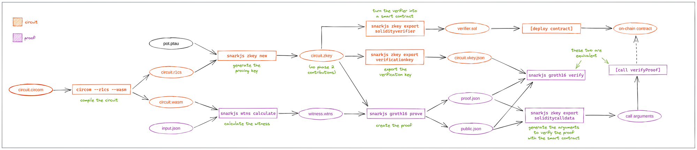

# snarkjs 资源

## circom 新语法: 模板/数组 

最近，circom 添加了一些新的语言功能，以便更轻松地输入模板和传递数组。 在这里查看：<https://github.com/iden3/circom/blob/master/mkdocs/docs/circom-language/anonymous-components-and-tuples.md>

<details>
<summary>英文原文</summary>

Recently, circom added some new language features for easier inputting into templates and passing arrays around. Check it out here: <https://github.com/iden3/circom/blob/master/mkdocs/docs/circom-language/anonymous-components-and-tuples.md>

</details>

## 电路编译流程图

当您开始使用 `snarkjs` 编译时，过程中生成了许多中间文件，要了解过程此图是必不可少的。 它是由 fvictorio 在 [0xPARC 学习小组](https://learn.0xparc.org/circom) 期间制作的



<details>
<summary>英文原文</summary>

This diagram is essential as you start working with the many artifacts generated by the `snarkjs` compilation pipeline. It was made by fvictorio during the first [0xPARC Learning Group](https://learn.0xparc.org/circom)

</details>

## `snarkjs` 步骤

在 <https://github.com/iden3/snarkjs> 的 README 中有 **27 个步骤**。 在这里，我们分解它们的含义以及您可以跳过的内容：

### _(预备)_ 安装代码

- 首先，根据<https://github.com/iden3/snarkjs#preliminaries>安装`snarkjs`和`circom`

### _(步骤 0 - 8)_ **下载预计算 Tau**

- 这些步骤创建了一个“ptau”文件，其中存储了 snarkjs 运行所需的 tau 功能(第 5 节中涵盖的数学细节)

- 你可以跳过自己设置这些； Polygon Hermez 已经完成了生成它们的仪式
    - 以太坊目前正在 <https://ceremony.ethereum.org/> 举办一个更大的仪式！

- 也可以**简单下载一个**预计算的 tau ，链接： <https://github.com/iden3/snarkjs#7-prepare-phase-2>，其中 tau 的幂次越高，电路中可包含的约束越多

### _(步骤 9 - 13)_ **电路编写+编译**

- 在 [zkrepl.dev](https://zkrepl.dev/) 中完成电路后，您可以将代码复制到本地 `circuit.circom` 文件中
- 需要指定公共/私人输入
- `circom circuit.circom --r1cs --wasm --sym` 将生成您需要证明的所有附加文件
- 第 11-13 步只是打印其他元数据或其他格式的 circom 文件

### _(步骤 14)_ **计算见证信息**

```sh
circuit_js$ node generate_witness.js circuit.wasm ../input.json ../witness.wtns
```

- 这使用从上一步生成的 JavaScript 文件 `generate_witness.js`，以及接收一个 `input.json`

### _(步骤 15 - 21)_ **计算证明key/可信设置阶段 2**

- 在这里，我们生成相关元数据以在 .zkey 文件中创建证明，称为 **proving key**

- 这需要一个“可信设置”，它在几个步骤中输入随机性以创建一个安全的证明密钥
     - 这通常会在许多方之间完成，只要他们不全部一起串通就是安全的

- 你应该添加一些你自己的熵，如 <https://github.com/iden3/snarkjs#16-contribute-to-the-phase-2-ceremony>

### _(步骤  22, 25 - 26)_ **计算验证key**

- 在这里，我们计算相关元数据以在 `.vkey.json` 文件中验证证明，称为 **verifying key**
- 也可以制作智能合约版本进行链上验证

### _(步骤 23 - 24)_ **创建和验证证明**

- 可以在 CLI 中创建和验证证明，但也可以在 JavaScript 中为 Web 应用程序创建和验证证明


<details>
<summary>英文原文</summary>

In the README of <https://github.com/iden3/snarkjs>, there are **27 different steps** that they tell you to follow. Here, we break down what they mean and which ones you can skip:

### _(Preliminaries)_ Installing code

- First, install `snarkjs` and `circom` according to <https://github.com/iden3/snarkjs#preliminaries>
- Reach out on discord if you have any difficulties with this

### _(Steps 0 - 8)_ **Download Powers of Tau**

- These steps create a “ptau” file which stores the powers of tau that are necessary for snarkjs to function (mathematical details covered in Session 5)

- You can skip setting these up yourself; Polygon Hermez has already done a ceremony to generate them
    - Ethereum is currently running an even larger ceremony at <https://ceremony.ethereum.org/> !

- **Just download one** from under <https://github.com/iden3/snarkjs#7-prepare-phase-2> where there are more powers of tau than your circuit's constraints

### _(Steps 9 - 13)_ **Circuit writing + compilation**

- After finishing your circuit in [zkrepl.dev](https://zkrepl.dev/), you can copy the code into a local `circuit.circom` file
- Need to specify public/private inputs
- `circom circuit.circom --r1cs --wasm --sym` will generate all the additional files you need for proving
- Steps 11-13 just print other metadata or the circom file in other formats

### _(Step 14)_ **Computing the witness**

```sh
circuit_js$ node generate_witness.js circuit.wasm ../input.json ../witness.wtns
```

- This uses the JavaScript file `generate_witness.js` generated from the previous step, as well as taking in an `input.json`

### _(Steps 15 - 21)_ **Computing the proving key / trusted setup phase 2**

- Here we generate the relevant metadata for creating proofs in a `.zkey` file, called a **proving key**

- This requires a “trusted setup”, which inputs randomness across a few steps to create a secure proving key
    - This would usually be done over many parties and is secure as long as they don't all collude

- You should add some entropy of your own as in <https://github.com/iden3/snarkjs#16-contribute-to-the-phase-2-ceremony>

### _(Step 22, Step 25\-26)_ **Computing the verification key**

- Here we compute the relevant metadata for verifying proofs in a `.vkey.json` file, called a **verification key**
- Can also make a smart contract version for on-chain verification!

### _(Steps 23 - 24)_ **Creating and verifying proofs**

- Can create and verify proofs in the CLI, but can also create and verify proofs in JavaScript for web apps

</details>