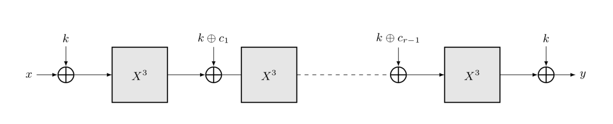

REF: https://byt3bit.github.io/primesym/mimc/

__MiMC__ 是一个专为 SNARK 应用设计的块密码和哈希函数家族。MiMC 在素数域上的低乘法复杂性使其适用于 ZK-SNARK 应用，如 ZCash。

MiMC 的核心组件是 APN 函数 $f(x) = x^3$。该函数在 $\mathbb{F}_q$ 中计算，其中 $q = p$ 或 $q = 2^n$ 对于素数 $p$ 和自然数 $n$。

密钥调度在每轮都添加相同的（均匀随机选择的秘密）密钥 $k \in \mathbb{F}_q$，然后跟随是轮常数加法。详细来说，MiMC 的加密函数是

$$
E_k(x) = (F_{r-1} \circ F_{r-2} \circ \dots \circ F_0)(x) + k,
$$

其中 $x \in \mathbb{F}_q$ 是明文，$r$ 是轮数，$F_i$ 是第 $i \geq 0$ 轮的轮函数，$k \in \mathbb{F}_q$ 是密钥。每个 $F_i$ 定义为

$$
F_i(x) = (x + k + c_i)^3,
$$

其中 $c_i \in \mathbb{F}_q$ 是轮常数，且 $c_0 = 0$。轮常数在 MiMC 的实例化时被选择为 $\mathbb{F}_q$ 的随机元素，然后被固定。注意，这里没有轮密钥，相反，每轮和最后一次都使用相同的密钥。所有的操作都在基础域 $\mathbb{F}_q$ 中定义。

对于一个 $2n$ 位的密钥，$(K_0, K_1) \in \mathbb{F}_q^2$ 被均匀随机选择。在这种情况下，两个密钥 $K_0$ 和 $K_1$ 在轮次中交替添加。因此，第 $i$ 轮的密钥调度定义为 $k_i = K_{i \pmod 2}$，轮函数定义为

$$
F_i(x) = (x + k_i + c_i)^3,
$$

对于 $i \geq 0$。

__Feistel-MiMC__ 是在 $\mathbb{F}_q$ 上构建的，使用相同的轮函数 $f(x) = x^3$。注意，在 Feistel-MiMC 中，输入（和输出）在 $\mathbb{F}_q^2$ 中。每轮定义为

$$
(x_{i+1}, y_{i+1}) = (y_i, x_i + (y_i + k_i + c_i)^3)
$$

其中 $(x_{i+1}, y_{i+1})$ 是第 $i$ 轮后的状态，$(x_0, y_0)$ 是输入，$k_i = (i+1)\cdot k$ 对于 $i \geq 0$。

英文原文

__MiMC__ is a block cipher and hash function family designed specifically for SNARK applications. The low multiplicative complexity of MiMC over prime fields makes it suitable for ZK-SNARK applications such as ZCash.

The core component of MiMC is the APN function $f(x) = x^3$. The function is computed in $\mathbb{F}_q$, where $q = p$ or $q = 2^n$ for a prime number $p$ and a natural number $n$. 

The key scheduling adds the same (uniformly randomly chosen secret) key $k \in \mathbb{F}_q$ at each round and is followed by the round constant addition. In detail, the encryption function of MiMC is

$$
E_k(x) = (F_{r-1} \circ F_{r-2} \circ \dots \circ F_0)(x) + k,
$$

where $x \in \mathbb{F}_q$ is the plaintext, $r$ is the number of rounds, $F_i$ is the round function for round $i \geq 0$, and $k \in \mathbb{F}_q$ is the key. Each $F_i$ is defined as

$$
F_i(x) = (x + k + c_i)^3,
$$

where $c_i \in \mathbb{F}_q$ are the round constants and $c_0 = 0$. The round constants are chosen as random elements of $\mathbb{F}_q$ at the instantiation of MiMC and then fixed. Note that there are no round keys, instead the same key is used in each round and once at the end. All the operations are defined in the underlying field $\mathbb{F}_q$.

For a $2n$-bit key, $(K_0, K_1) \in \mathbb{F}_q^2$ is chosen uniformly randomly. In this case the two keys $K_0$ and $K_1$ are added alternately through the rounds. Hence, the key scheduling for round $i$ is defined as $k_i = K_{i \pmod 2}$, and the round function is defined as 

$$
F_i(x) = (x + k_i + c_i)^3,
$$

for $i \geq 0$.

__Feistel-MiMC__ is constructed over $\mathbb{F}_q$ using the same round function $f(x) = x^3$. Note that in Feistel-MiMC the input (and output) is in $\mathbb{F}_q^2$. Each round of is defined as

$$
(x_{i+1}, y_{i+1}) = (y_i, x_i + (y_i + k_i + c_i)^3)
$$

where $(x_{i+1}, y_{i+1})$ is the state after round $i$, $(x_0, y_0)$ is the input and $k_i = (i+1)\cdot k$ for $i \geq 0$. 

