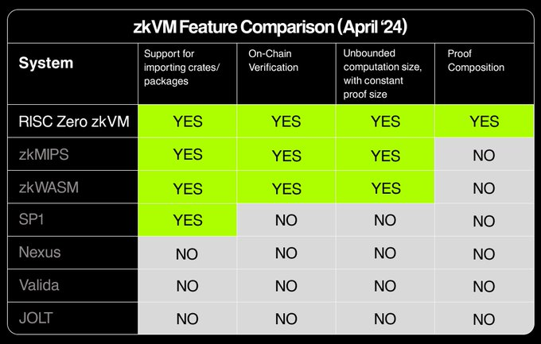

# 2024Q2 ZKP新闻

## 六月

### 2024.6.26

**【论文】**

- Escudero等人在论文《Dishonest Majority Multi-Verifier Zero-Knowledge Proofs for Any Constant Fraction of Corrupted Verifiers》中，提出了一种新的多验证者零知识证明协议，通过在环上实现并优化通信复杂性。
  *注：多验证者ZKP不是经常见到的ZKP场景，但可应用于存在不诚实对手方的预言机场景。*
  [论文](https://eprint.iacr.org/2024/997)

- Park等人在《zkVoting: Zero-knowledge proof based coercion-resistant and E2E verifiable e-voting system》论文中提出了一种结合新型可撤销承诺方案和ZKP的抗胁迫电子投票系统，它能保证选民的匿名性和投票的端到端可验证性。
  [论文](https://eprint.iacr.org/2024/1003)

- Kim等人在《Relaxed Vector Commitment for Shorter Signatures》中通过引入向量半承诺和关键注入技术，显著提高了基于MPCitH的签名方案的效率和实用性，同时保持了强安全性。
  [论文](https://eprint.iacr.org/2024/1004)

- zkSecurity的Chaliasos和matterlab的多人在其发表的《Towards a Formal Foundation for Blockchain Rollups》论文中对Rollup L2进行了正式分析和设计，通过Alloy形式化定义了Rollup L2。
  *注：Alloy是一种用于表达软件系统中复杂结构约束和行为的声明式规范语言。*
  [论文](https://arxiv.org/abs/2406.16219)，
  [代码](https://github.com/StefanosChaliasos/zk-rollup-security)。

- Inversed Tech的Benarroch等人在《SoK: Programmable Privacy in Distributed Systems》论文中，对当代分布式区块链协议中的隐私协议进行了系统化调研，为未来可编程隐私设计提供了建议和最佳实践。
  [论文](https://eprint.iacr.org/2024/982)

**【开源】**

- FHE全同态加密经常被说成是ZKP的接班人，但是限制于他的性能，很难实用，这里看到了一个电路中实现全同态的例子，TFHE方案的约束数量为1.5billion。
  *注：根据经验，其对应zkey预估为750GB，证明机器的内存可能需要1T～1.5T。*
  [博客](https://pps-lab.com/blog/fhe_arithmetization/)，
  [代码](https://github.com/zkFHE/circomlib-fhe)。

- Tachyon是一个由GPU驱动的模块化ZKP证明后端，用CPP编写，测试数据显示比现有的rapidsnark、Scroll's Halo2等证明后端都要快。
  [测试数据](https://blog.kroma.network/tachyon-a-much-faster-and-lighter-halo2-68b4b4d95999)，
  [代码](https://github.com/kroma-network/tachyon)。

**【信息】**

- Antalpha Labs发布[6月23日的ZKP相关总结笔记](https://mp.weixin.qq.com/s/FGXmFlbGjKw-8DePtIOHOQ)。

- Eurocrypt 2024 的视频发布，SNARKs专场包括Lasso/Jolt等内容。
  [日程表](https://eurocrypt.iacr.org/2024/program.php)，
  [SNARKs专场视频](https://www.youtube.com/watch?v=_WsCQc9Elcg)。

- 看起来新加坡金融管理局可能正在考虑零知识证明和"按合规设计"的方案。
  [𝕏](https://twitter.com/therealyingtong/status/1805095934008996002)，
  [官网](https://www.bis.org/about/bisih/topics/cbdc/mandala.htm)。

- 基于Solana的ZK Compression技术，允许开发者和用户压缩链上状态，显著降低成本。可以在不牺牲安全性、性能和可组合性的前提下，有望驱动大规模应用开发。
  [官网](https://www.zkcompression.com/)

**【学习】**

- Antalpha Labs发布一篇名为《Ariel Gabizon: The KZG PCS scheme and PlonK SNARK》的博客，一步一步的讲解了从KZG到简化的Plonk，再加上lookup机制的讲解，如果嫌原始版本太过复杂的，可以看看这个简化版本。
  [博客](https://mp.weixin.qq.com/s/EzHXB7e5ZHkwuIuGUUnoiQ)

- zkStudyClub发布视频讲解《FRI-Binius: Polylogarithmic Proofs for Multilinears over Binary Towers》。
  *注：FRI是STARK的核心，Binius是V神最近点名的ZKP下一代核心。*
  [视频](https://www.youtube.com/watch?v=iZlJDT7V8Q4)

### 2024.6.19

**【论文】**

- Devillez等人在《Verifiable and Private Vote-by-Mail》论文中提出了一种远程投票系统，能够在保障选票可验证性和隐私性的同时，抵御多组件串谋作弊的风险，其中可验证性使用了ZKP技术。
  [论文](https://eprint.iacr.org/2024/926)

- Liu等人在《Scalable Collaborative zk-SNARK and Its Application to Efficient Proof Outsourcing》论文中，提出用ZKP外包扩展zk-SNARK的方案。该研究通过多变量多项式计算技术，去中心化证明生成过程，有效提升了运算效率并减少了对中心服务器的依赖。
  *注：该工作基于Libra和HyperPlonk工作，整体来说属于sumcheck协议流派。*
  [论文](https://eprint.iacr.org/2024/940)

- Liu等人在《SmartZKCP: Towards Practical Data Exchange Marketplace Against Active Attacks》论文中提出增强数据交易市场安全性的新方案SmartZKCP，有效应对潜在攻击，提高性能及公平性。
  *注：该文中ZKP方案使用GROTH16，重点在构造避免信息泄漏的加解密协议。*
  [论文](https://eprint.iacr.org/2024/941)

- Chaya Ganesh等人在《Dual Polynomial Commitment Schemes and Applications to Commit-and-Prove SNARKs》论文中提出了一种新型的双多项式承诺方案，允许在单变量和多变量见证承诺之间灵活转换，并应用于CP SNARKs，展示了更佳的证明尺寸与验证效率，提升了智能合约的灵活性和实用性。
  [论文](https://eprint.iacr.org/2024/943)

- Little等人在《Secure Account Recovery for a Privacy-Preserving Web Service》论文中设计了一种在平台用户忘记密码时，无需暴露任何用户联系信息即可实现账户恢复的加密协议。该协议专为需要高度保护用户隐私的网络服务设计，例如帮助性侵受害者通过匹配服务找到同案受害者的平台。
  *注：该文特意避免使用ZKP，使用OPRF（茫然伪随机函数）来实现。*
  [论文](https://eprint.iacr.org/2024/962)

- Ingonyama的Inbasekar等人将API技术文档以论文的样式写在《ICICLE v2: Polynomial API for Coding ZK Provers to Run on Specialized Hardware》中。
  [论文](https://eprint.iacr.org/2024/973)

**【开源】**

- Certik发布zkWasm的Coq自动形式化验证代码。
  [代码](https://github.com/CertiKProject/zkwasm-fv)

**【信息】**

- zkSecurity的David发布noname证明系统的使用视频。
  [视频](https://www.youtube.com/watch?v=pQer-ua73Vo)

- 一个Poseidon哈希的学习网站，包括详细的安全分析等。
  [网站](https://autoparallel.github.io/overview/index.html)

- Antalpha Labs发布[6月16日的ZKP相关总结笔记](https://mp.weixin.qq.com/s/-K0MvJFSzTbCAxKs7wOrYw)。

- zkSecurity发布一个ZK相关新闻的链接聚合网站。
  [网站](https://news.zksecurity.xyz/)

- PSE宣布启动Semaphore V4协议的第二阶段可信设置仪式(trusted setup)。参与者需满足特定GitHub条件。
  [链接](https://ceremony.pse.dev/projects/Semaphore%20V4%20Ceremony)，
  [𝕏](https://x.com/PrivacyScaling/status/1800478650200166866)

- Lambda Class宣布在EthCC 2024期间组织4天（7.6～7.9，Brussels）的黑客松。
  [链接](https://events.lambdaclass.com/lambdahackweek-2024)

### 2024.6.12

**【论文】**

- 🌟Tartu大学（爱沙尼亚）的Helger Lipmaa在《Polymath: Groth16 Is Not The Limit》论文中，提出了一种新型的zk-SNARK技术Polymath，该技术基于Groth16，并将**proof长度比Groth16减少大致一半**（Groth16是目前认为proof最短的ZKP系统），并在具有较高安全性的同时，优化了证明计算和批量验证过程。方案重点将proof中的G2点换成多项式承诺，并将Groth16中的五个陷门减为一个，做到与KZG兼容。
  *注：该文目前为预印版，尚未经过其他专家的审查，如果方案实用可行的话，也许会是**ZKP历史上的另外一个里程碑**。*
  [论文](https://eprint.iacr.org/2024/916)

- Kurik等人在《Novel approximations of elementary functions in zero-knowledge proofs》论文中分析了零知识证明中超越函数的计算方法，提出了对于超越函数的代数近似新策略，并评估其与最佳多项式近似的精度与效率。
  *注：超越函数是指那些不能表示为加、减、乘、除、乘方和开方等代数运算有限组合的函数，例如指数函数、对数函数和三角函数等。*
  [论文](https://eprint.iacr.org/2024/859)

- Zhang等人在《Loquat: A SNARK-Friendly Post-Quantum Signature based on the Legendre PRF with Applications in Ring and Aggregate Signatures》论文中提出了一种基于Legendre PRF的新型抗量子签名方案Loquat，相较于SPHINCS+，在签名大小上仅有46KB，且在SNARK中约束数量更少。
  [论文](https://eprint.iacr.org/2024/868)

- Santos等人在《On cycles of pairing-friendly abelian varieties》论文中提出，将配对友好椭圆曲线的概念扩展至阿贝尔簇，实现更高效的配对基础SNARKs，并给出了几种构造。
  [论文](https://eprint.iacr.org/2024/868)

- 复旦大学的Zhang等人在《Epistle: Elastic Succinct Arguments for Plonk Constraint System》论文中，展示出一种新型的弹性SNARK证明系统。该系统优化了时间和空间的效率，为不同配置的证明者提供时间和空间上的平衡。
  *注：该工作基于hyperplonk的sumcheck协议。*
  [论文](https://eprint.iacr.org/2024/872)

- 来自山大、北航和浪潮的多位作者在《zkCross: A Novel Architecture for Cross-Chain Privacy-Preserving Auditing》中提出了一种新型的跨链隐私保护审计架构。针对跨链审计中的三大挑战设计了双层跨链架构，并用实验评估了其实用性。
  [论文](https://eprint.iacr.org/2024/888)

- Matter Labs联合Chaliasos等人在论文《Analyzing and Benchmarking ZK-Rollups》中对ZK-Rollups进行了深入的理论和实证研究，着重探讨了ZK-EVM，并初步发现了实施ZK-Rollups时的权衡和改进点，为未来有关系统的发展方向提供了重要视角。
  [论文](https://eprint.iacr.org/2024/889)

- Angel等人在2023年的论文《Reef: Fast Succinct Non-Interactive Zero-Knowledge Regex Proofs》中，提出并开发了Reef系统，专注于支持广泛正则表达式语法并显著提升了证明生成以及验证的速度。
  *注：通过特殊的Skipping设计，提高效率。*
  最近发布了[视频](https://www.youtube.com/watch?v=68-BuxRR-EA)和
  [slides](https://www.slideshare.net/slideshow/zkstudyclub-reef-fast-succinct-non-interactive-zero-knowledge-regex-proofs/269484380)来进行讲解。
  [论文](https://eprint.iacr.org/2023/1886)，
  [代码](https://github.com/eniac/Reef)。

**【开源】**

- BitVMX的首个PoC开源代码发布。
  [代码](https://github.com/FairgateLabs/BitVMX-CPU)

- Jens Groth（Groth16的发明者）加入了[Nexus](https://nexus.xyz/)，并发布了zkVM，旨在使用内存一致性技术提速，目标为实现ZKP中每秒万亿（trillion）次CPU Cycles。
  *注：约为现在5GHz CPU速度的200倍。*
  [白皮书](https://nexus-xyz.github.io/assets/nexus_whitepaper.pdf)，
  [代码](https://github.com/nexus-xyz/nexus-zkvm)。
  *注2：nexus才融了2500万。*
  [𝕏](https://x.com/NexusLabsHQ/status/1800324588116860933)

**【信息】**

- Antalpha Labs发布[6月9日的ZKP相关总结笔记](https://mp.weixin.qq.com/s/W1ssTZM9kkE6JrBm2W44zA)。

- zkHack发布了[2024年5月ZKP相关动态回顾](https://substack.com/home/post/p-145173116)。

- a16z发布博客，表示其团队的Lasso和Jolt项目正取得显著进展，在该博客中回答了一些常见问题，并表示团队正致力于整合Binius承诺方案，以进一步提升Jolt性能。
  [博客](https://a16zcrypto.com/posts/article/understanding-jolt-clarifications-and-reflections/)

- zkSecurity发布关于ZKP安全工具现状的研究报告。报告探讨了ZKP可能存在的漏洞和目前的漏洞查找安全工具。
  [博客](https://www.zksecurity.xyz/blog/posts/zksecurity-tools/)

- ZK Hack宣布将在加拿大Montréal于8月9日至11日举办其第四届线下黑客松。
  [主页](https://www.zkmontreal.com/)

**【学习】**

- ZK Hack社区开设了《MoonMath Manual》学习小组，联合Least Authority专注于ZKP领域的理论与实践。课程由浅入深，为密码学新手和资深研究者提供了丰富的学习材料。课程正在进行中。
  [课程主页](https://zkhack.dev/zk-study-group-moonmath-manual/)

### 2024.6.5

**【论文】**

- Sefranek等人在论文《How (Not) to Simulate PLONK》中，发现了并修复了PLONK零知识证明系统中的一个安全漏洞，同时证明了该系统的修正版本能够实现统计零知识，此外他们还针对先前版本的PLONK进行了攻击，展示它不能满足统计见证不可区分性的标准。
  [论文](https://eprint.iacr.org/2024/848)

- 来自Polyhedra(zkBridge)的Xie等人在《Almost optimal succinct arguments for Boolean circuit on RAM》论文中，针对数据并行布尔电路在RAM上的零知识证明问题设计了算法，减少了内存和计算时长。
  *注：布尔电路在传统哈希计算（如SHA256）中被大量使用，因此可以潜在提高传统哈希计算的速度。*
  [论文](https://eprint.iacr.org/2024/839)

- Agrawal等人在《Publicly auditable privacy-preserving electoral rolls》论文中提出了一种公共审计且保护隐私的选举名册方案。该研究贡献在于能够允许合格的选民验证自己的参加情况，同时使得审计员可以进行统计审计，保障了整个投票过程的公正性与隐私安全。
  [论文](https://arxiv.org/abs/2402.11582)

- Yang等人在《Multivariate Multi-Polynomial Commitment and its Applications》论文中定义并阐述了多变量多项式(MMP)承诺方案，提供了具有恒定提交大小和对数大小证明的高效构建，并增强实现了零知识特性。此方案结合了零知识范围证明，用途包括SNARK的高效聚合和基于ZKRP的车辆GPS轨迹零知识证明。
  [论文](https://eprint.iacr.org/2024/827)

- Lee等人在《Cougar: Cubic Root Verifier Inner Product Argument under Discrete Logarithm Assumption》论文中提出了一种IPA ZKP系统 Cougar。该系统通过结合两种不同的平方根 IPA 来克服在离散对数假设下平方根复杂度的局限性，并引入新型基于 Plonkish 的证明系统来加强证明过程。
  [论文](https://eprint.iacr.org/2024/616)

**【开源】**

- Lita Foundation 发布了Valida zkVM 的C编译器的Alpha版本，按他们的测试数据显示，SHA256的效率比Jolt快5倍，比同样是Plonky3底层的SP1快54倍。注：Valida是基于Plonky3 的zkVM。
  [博客](https://www.lita.foundation/blog/announcing-litas-valida-c-compiler-zkvm-the-first-step-towards-true-universal-zk)。
  编译器代码尚未开源，二进制可在[此处](https://github.com/lita-xyz/llvm-valida-releases)下载。
  另外，Valida的开源地址在[这里](https://github.com/valida-xyz/valida)。

**【信息】**

- Antalpha Labs发布[6月2日的ZKP相关总结笔记](https://mp.weixin.qq.com/s/Y8wAO4Qab10VKUZIRPVEhg)。

- Alpen写的一篇关于当前SNARK状态的简单综述博客，根据密码学工具进行分类解析。
  [博客](https://x.com/lagrangedev/status/1797995938251968638)

- Lagrange宣布，其ZK Prover网络已在EigenLayer上成功上线。该网络汇集了包括Coinbase、OKX在内的多家顶级运营商，支持多种复杂证明类型，能使开发者通过智能合约直接获取不同证明。
  [𝕏](https://x.com/lagrangedev/status/1797995938251968638)

## 五月

### 2024.5.29

**【论文】**

- zkfi tech的Sahu等人在《SeDe: Balancing Blockchain Privacy and Regulatory Compliance by Selective De-Anonymization》论文中提出了一种选择性去匿名化(SeDe)的框架，旨在利用阈值加密和ZKP实现区块链上隐私保护与监管合规的平衡。
  *注：可看作Tornado Cash的优化可监管版本。*
  [论文](https://arxiv.org/abs/2311.08167)

- MIT的South和EZKL的Camuto等人发布《Verifiable evaluations of machine learning models using zkSNARKs》论文，通过zkSNARKs实现对机器学习模型的可验证评估。
  *注：可关注该文的实验数据部分，比如用nanoGPT做推理的证明时间为2800s。*
  [论文](https://arxiv.org/abs/2402.02675)

- Mehmet Sabir Kiraz与nChain团队在《How to Redact the Bitcoin Backbone Protocol》论文中，为满足如GDPR的遗忘权等法律需求，保证在无需信赖第三方的情况下安全擦除历史数据，其方案实现无需硬分叉。实现方案应用了ZKP技术。
  [论文](https://eprint.iacr.org/2024/813)

- Chiang等人在论文《Detecting Rogue Decryption in (Threshold) Encryption via Self-Incriminating Proofs》中提出了一个通过自我揭露证据来检测阈值加密中不当解密的方法。该方法要求解密参与者在解密任何密文时都必须生成与其解密行为有关的ZKP证据，并利用这种做法形成审计链，提高对恶意解密者的威慑。
  [论文](https://eprint.iacr.org/2024/794)

- Alexandru等人在《Sublinear-Round Broadcast without Trusted Setup》论文中提出了一个无需信任的亚线性轮次的广播协议。核心思想是减少信赖关系，并利用了ZKP来实现这种弱共识。
  [论文](https://eprint.iacr.org/2024/770)

- zkSync背后的Matter Labs的Stronati等人在《Clap: a Rust eDSL for PlonKish Proof Systems with a Semantics-preserving Optimizing Compiler》中提出并实现了Clap，一种基于Rust的eDSL，它基于Agda实现了可形式化证明的电路语言。
  [论文](https://arxiv.org/abs/2405.12115)

- Matter Labs的Firsov等人在论文《The Ouroboros of ZK: Why Verifying the Verifier Unlocks Longer-Term ZK Innovation》中重新观察了递归证明，尤其是要上链验证的递归ZKP。
  *注：本文可作为技术文档参考一些主流链的递归ZKP实现情况。*
  *注2：Ouroboros：衔尾蛇。*
  [论文](https://eprint.iacr.org/2024/768)

**【开源】**

- Ingonyama开源了他们在硬件上实现Binius的基础构件。
  [代码](https://github.com/ingonyama-zk/open-binius)

**【信息】**

- Antalpha Labs发布[5月26日的ZKP相关总结笔记](https://mp.weixin.qq.com/s/KZlYQtYHjiz9karqlMcIKA)。

- RISC Zero宣布他们开始启动主网的Verifier，目前看起来准备支持以太坊和base。
  [𝕏](https://x.com/RiscZero/status/1795524909260501479)

**【学习】**

- Antalpha Labs组织了Plonk课程。
  [课程信息](https://github.com/Antalpha-Labs/zkp-academy/tree/main/Plonk)，
  [课程资料](https://github.com/sec-bit/learning-zkp)

### 2024.5.22

**【论文】**

- Jens Groth（即Groth16的作者）等人在论文《Fast Batched Asynchronous Distributed Key Generation》中提出了异步通信环境中阈值Schnorr签名的两项创新技术：异步保密共享协议和基于超可逆矩阵的高效算法。该协议取得了通讯和计算复杂性两部分的提高。
  *注：阈值签名也就是我们经常提到的MPC签名算法，在区块链的安全领域具有极其广泛的应用。*
  [论文](https://link.springer.com/chapter/10.1007/978-3-031-58740-5_13)

- Sora Suegami（zkEmail的作者）在其最新的论文《Extractable Witness Encryption for Signed Vector Digests from Pairings and Trust-Scalable One-Time Programs》中提出了首个基于配对的见证加密（WE）方案。
  *注：该方案可以被用来将链上合约与多因素验证结合，该文的最大贡献，是做到签名者在固定周期内进行固定量的计算和通信，与密文数量无关。*
  [论文](https://eprint.iacr.org/2024/762)

- 来自IoTex的Fan等人在《Speeding Up Multi-Scalar Multiplications for Pairing-Based zkSNARKs》论文中，改进了以前基于预计算的多标量乘法计算方法，提出的优化桶通用构造在理论上和实验中均显示出显著的性能改进。
  [论文](https://eprint.iacr.org/2024/750)

- Choudhuri等人在论文《Mempool Privacy via Batched Threshold Encryption: Attacks and Defenses》中提出一种基于多项式承诺的隐私保护机制，通过批处理阈值加密技术，在区块链环境下试图解决DeFi中的MEV等问题等，并在有限资源的区块链环境中提高了交易加密和解密的效率。
  [论文](https://eprint.iacr.org/2024/669)

- Commey等人在其论文《Securing Blockchain-based IoT Systems with Physical Unclonable Functions and Zero-Knowledge Proofs》中，通过整合物理不可克隆函数和零知识证明解决了基于区块链的物联网系统中Identity安全的挑战。
  [论文](https://arxiv.org/abs/2405.12322)

- Fuchsbauer等人在《Concurrently Secure Blind Schnorr Signatures》论文中提出了与标准256位 Schnorr 签名兼容的并发安全盲签名协议，可抵御DoS攻击，并引入谓词逻辑，可限定条件的盲签名。方案可以对比特币的交易进行签名。
  *注：盲签名指掩盖签名者的信息，可用在匿名电子投票等场景。*
  [论文](https://link.springer.com/chapter/10.1007/978-3-031-58723-8_5)

- Srinath Setty和Justin Thaler合作的[Lasso](https://link.springer.com/chapter/10.1007/978-3-031-58751-1_7)和[Jolt](https://link.springer.com/chapter/10.1007/978-3-031-58751-1_1)正式在EUROCRYPT 2024上发表。
  _注：Lasso是一种基于sumcheck协议，电路仅包含查找（lookup）的一种证明系统；Jolt是基于Lasso的VM。_

- Eagen等人在《Bulletproofs++: Next Generation Confidential Transactions via Reciprocal Set Membership Arguments》论文中提出了一种更为高效且体积更小的零知识证明系统------Bulletproofs(BP)++。该系统旨在提升含有加密货币交易的"机密交易"（CT）的实用性和性能，可直接替换现有的BP，并保留原来的所有特性。通过新颖的排列和集合成员方法，BP++在保证安全性的同时，优化了证明到聚合和验证的速度。
  *注：Bulletproof被用在Monero（门罗）中。*
  [论文](https://link.springer.com/chapter/10.1007/978-3-031-58740-5_9)

**【开源】**

- zksecurity开发了类Rust和Go的zkApp开发语言noname，证明系统对接kimchi（mina的证明系统）。
  [代码](https://github.com/zksecurity/noname)

**【信息】**

- yingtong.eth分享了她在密码学与隐私会议[ReCAP](https://recapworkshop.online/)上的笔记和总结。
  [𝕏](https://twitter.com/therealyingtong/status/1786382434826903895)

- 其中一个叫做[Callisto Vault](https://www.projectcallisto.org/callistovault)的项目比较有意思，用ZKP做暴力受害者匹配。

- ZKProof 6 in Berlin [正在直播](https://zkproof.org/events/zkproof-6-berlin/)，将持续三天。

- Antalpha Labs发布[5月19日的ZKP相关总结笔记](https://mp.weixin.qq.com/s/hS2Fwk1zZueuIItwCSiw3Q)。

### 2024.5.15

**【论文】**

- Kuznetsov等人在《Efficient and Universal Merkle Tree Inclusion Proofs via OR Aggregation》论文中提出了一种新的基于"或"逻辑的默克尔树证明聚合方案，有效地提高了零知识证明系统在区块链应用中的效率与可扩展性。
  [论文](https://arxiv.org/abs/2405.07941)

- Lerner等人在论文《BitVMX: A CPU for Universal Computation on Bitcoin》中提出了一种新虚拟机设计方案BitVMX，整体思想与BitVM类似，其主要贡献是采用程序追踪的哈希链、内存映射寄存器和一种新的挑战响应协议来验证通用CPU。
  *注：这是一种新的设计方式，其成本与内存的写入次数有关，尚无实验证明其效率能高过目前的BitVM实现，但值得深入研究。*
  [论文](https://arxiv.org/abs/2405.06842)

- Benoît Libert等人在《Simulation-Extractable KZG Polynomial Commitments and Applications to HyperPlonk》论文中提出用于HyperPlonk的KZG多项式承诺方案，证明了其在强化模拟提取性（SE）方面的有效性。该研究为多元多项式互动预言证明的安全性能提升提供了新途径。
  [论文](https://link.springer.com/chapter/10.1007/978-3-031-57722-2_3)

- Baldi等人在《Zero Knowledge Protocols and Signatures from the Restricted Syndrome Decoding Problem》论文中分析了R-SDP问题在零知识协议中的应用，展示了其在降低通信成本方面的潜力，并提出了R-SDP(G)变体，为设计更具竞争力的零知识协议提供了新途径。
  [论文](https://link.springer.com/chapter/10.1007/978-3-031-57722-2_8)

- Dutta等人在论文《Succinct Verification of Compressed Sigma Protocols in the Updatable SRS Setting》中提出了一种新颖的内积论证，专门设计用于压缩Sigma协议框架，尤其是在可更新的SRS设置中。
  [论文](https://link.springer.com/chapter/10.1007/978-3-031-57722-2_10)

- Zhang等人在《Efficient KZG-Based Univariate Sum-Check and Lookup Argument》论文中提出了一种新颖的基于KZG的求和检查和查找论证方案Locq，该方案以高效率为特点，证明成本仅为k大小的多标量乘法，验证成本包括一次配对和一次群标量乘法，显著降低现有技术的计算需求。
  [论文](https://link.springer.com/chapter/10.1007/978-3-031-57722-2_13)

- Campanelli等人在《Lookup Arguments: Improvements, Extensions and Applications to Zero-Knowledge Decision Trees》论文中提出并扩展了"查找论证"的概念，为非算术操作如范围检查、XOR和AND等提供了新的解决方案，并将此技术应用于零知识决策树，提供了一种在保持数据结构隐私的同时证明统计信息的方法。
  [论文](https://link.springer.com/chapter/10.1007/978-3-031-57722-2_11)

**【开源】**

- zkWasm的Prover现已开源。[代码](https://github.com/DelphinusLab/zkWasm-prover/)

- 一个使用Noir开发的猜地理位置的ZKP小游戏。[代码](https://github.com/Envoy-VC/zk-guesser)

- Succinct Labs宣布其zkVM SP1实现新突破，成功集成GROTH16链上验证技术。
  [𝕏](https://twitter.com/pumatheuma/status/1788307892208377919)

**【信息】**

- Ingonyama推出ZaKi，一种基于ICICLE库的零知识证明托管服务。ZaKi通过硬件优化，实现高效成本效益的ZK计算，适用于高核心CPU、先进Nvidia GPU等计算密集型任务。
  *注：Ingonyama一直以硬件加速为主要突破点，这次提供SaaS的ZK云服务有潜在改变ZK证明市场的上云方式。*
  [链接](https://medium.com/@ingonyama/introducing-zaki-28be0ba89d69)

- Antalpha Labs发布[5月12日的ZKP相关总结笔记](https://mp.weixin.qq.com/s/mXJwci1wdoaZXmMcxE4ipQ)。

**【学习】**

- Alessandro Chiesa （Marlin作者）和 Eylon Yogev 关于ZKP的新书，从密码学角度逐步从SP/IP/PCP/IOP讲过来，适合从密码学角度理解ZKP。
  [书籍主页](https://hash-based-snargs-book.github.io/)，
  [pdf下载](https://github.com/hash-based-snargs-book/hash-based-snargs-book/blob/main/snargs-book.pdf)。

- 在BIU 2023年2月举办的第13届密码学冬季课程，主题在区块链技术，包括区块链共识、ZKP和DeFi等在内。
  [查看视频](https://www.youtube.com/playlist?list=PL8Vt-7cSFnw1gx51WHRgAtioVqAjzMS1w)，
  [课程官网](https://cyber.biu.ac.il/event/the-13th-biu-winter-school-on-cryptography/)。

### 2024.5.8

**【论文】**

- Wee等人在《Succinct Functional Commitments for Circuits from k-Lin》论文中首次提出了一种基于双边k-Lin假设的配对函数承诺方案，该方案的承诺大小和开启大小均为常数长度。
  *注：k-Lin是基于离散对数问题的一类更强的假设，密码学上弱假设意味着安全依赖更少，更难破解，但强假设有可能提供更高的安全保障和计算效率。*
  [论文](https://eprint.iacr.org/2024/688)

- Novakovic等人在《On Proving Pairings》论文中提出，通过将配对验证的最终指数步骤替换为更为高效的"残数检查"并集成到Miller循环中，可以显著提高配对验证的效率。
  *注：该研究成果有助于在BitVM上更高效验证ZKP。*
  [论文](https://eprint.iacr.org/2024/640)

- Gur等人在《On the Power of Interactive Proofs for Learning》论文中以GKR基础，提出了在机器学习场景下更高效的证明协议。
  [论文](https://arxiv.org/abs/2404.08158)

**【博客】**

- Vitalik发文讲解Binius，并提供了一个简单版的源代码供参考。
  *注：Binius是由许多密码学大佬共同盛赞的下一代ZKP基础组件，重点是让ZKP使用更适合现代计算机进行计算的二进制。*
  [博客](https://vitalik.eth.limo/general/2024/04/29/binius.html)
  | [代码](https://github.com/ethereum/research/tree/master/binius)
  | [相关ppt](https://docs.google.com/presentation/d/1WuTiof1BiaL6vB50CSeb-hvi5H4j_oqUt19-sZTQEB4)

**【开源】**

- Keelung是一种基于Haskell的ZKP DSL（编程语言），后端基于[Aurora](https://github.com/scipr-lab/libiop)。
  [文档](https://btq.gitbook.io/keelung/)
  | [代码](https://github.com/btq-ag/keelung)

**【信息】**

- zkHack发布了[2024年4月ZKP相关动态回顾](https://zkmesh.substack.com/p/zkmesh-apr-2024-recap)。

- zkSummit11已经结束，[观看视频](https://www.youtube.com/watch?v=_Ao6ikWSgOY&list=PLj80z0cJm8QFy2umHqu77a8dbZSqpSH54&index=2)，[a16z的笔记](https://a16zcrypto.com/posts/article/zero-knowledge-summit-zksummit-2024-field-notes/)。

- Antalpha Labs发布[5月4日的ZKP相关总结笔记](https://mp.weixin.qq.com/s/dezluqn-VtqCUjvtXIbYcQ)。

**【新闻】**

- Polyhedra宣布开放其ZKP系统Expander的源代码，基于GKR协议实现。该系统在 Apple M3 Max 机器上能够达到 4500 次/秒 Keccak-f 置换运算。
  _注：Polyhedra曾在zkBridge论文中实现分布式GKR证明器。_
  [链接](https://polyhedra.medium.com/introducing-expander-the-fastest-gkr-proof-system-to-date-bdd07d05c23e)
  | [源码](https://github.com/PolyhedraZK/Expander)

## 四月

### 2024.4.30

**【论文】**

- 3MI Labs与Ulvetanna合作在论文《Vision Mark-32: ZK-Friendly Hash Function Over Binary Tower Fields》中提出了一种基于Binary Tower Fields的特别设计，并在FPGA上实现了全流水线，实验显示比Poseidon哈希高一个数量级。
  *注：本文也有助于理解Binary Tower Fields。* 
  [论文](https://eprint.iacr.org/2024/633)

- Alqahtani等人在《Privacy-Preserving Billing for Local Energy Markets》论文中提出了一个名为PBP-LEMs的隐私保护电力计费协议。
  *注：是利用的ZKP的应用案例。*
  [论文](https://arxiv.org/abs/2404.15886)

- Sun等人在《zkLLM: Zero Knowledge Proofs for Large Language Models》论文中提出zkLLM，专门用于验证大语言模型的输出真实性，使用sumcheck协议，能在15分钟内为含13亿参数的模型生成正确性证明，且证明文件大小不足200kB。
  [论文](https://arxiv.org/abs/2404.16109)

- Barthoulot等人在论文《Cryptographic Accumulators: New Definitions, Enhanced Security, and Delegatable Proofs》中提出了一种新的密码累加器定义，并引入了"私人评估的不可伪造性"安全属性，以增强密码积的安全性并保护其免受伪造攻击。
  *注：累加器在一些场景可替换应用广泛的Merkle Tree，因此也有很高的关注度。* 
  [论文](https://eprint.iacr.org/2024/657)

**【开源】**

- 开源项目Valida，是基于Plonky3的zkVM项目，该项目还较为早期，未看出特别的优势。
  [源代码](https://github.com/valida-xyz/valida)
  | [ZK11视频](https://www.youtube.com/watch?v=9yqW9z7h-bc)

**【新闻】**

- Polygon团队发布最新基准测试结果，显示其FPGA证明器Plonky2性能显著优于CPU实例，处理速度提升40%，成本更低。此次测试中尚未启用硬件优化的SNARK技术Binius。
  [𝕏](https://twitter.com/gakonst/status/1783589455271739678)

- Encode Club组织的ZK Bootcamp将于5月20日开课，为期六周。[现在接受报名](https://www.encode.club/zk-bootcamp)。

**【博客】**

- 一篇讲如何在比特币上做ZKP的文章。
  _注：内容丰富，结论是目前比特币上实现ZKP还很困难。_
  [博客](https://blog.csdn.net/mutourend/article/details/137209899)

- 一篇关于发布Ligetron的博客，Ligetron是基于Ligero的zkML框架。对于4.4亿浮点指令和30亿整数指令，证明器运行了约14小时（50,000秒），验证器运行了大约6.5小时（22,000秒）。proof长度和峰值内存大约是10GB。
  _注：代码未开源。_
  [博客](https://medium.com/@NIM_Network/introducing-ligertron-1-0-paving-the-way-for-ai-verification-and-ownership-at-scale-39a7bd00c6b3)

### 2024.4.24

**【论文】**

- OpenZeppelin团队在《The Last Challenge Attack: Exploiting a Vulnerable Implementation of the Fiat-Shamir Transform in a KZG-based SNARK》一文中，揭示了Fiat-Shamir变换在**KZG基础的PLONK验证器实现中的潜在漏洞**。该发现已及时向相关开发者披露并得以修复。
  [论文](https://eprint.iacr.org/2024/398)，
  [修复记录](https://github.com/Consensys/gnark/security/advisories/GHSA-7p92-x423-vwj6)，
  [攻击PoC](https://github.com/OpenZeppelin/publications/tree/main/papers/the-last-challenge-attack/proof-of-concept)。

- Balbás等人在论文《Modular Sumcheck Proofs with Applications to Machine Learning and Image Processing》中提出了一种模块化可验证计算框架，**利用sumcheck协议提高ML中卷积操作的性能**。
  [论文](https://eprint.iacr.org/2023/1342)，
  [代码](https://github.com/imdea-software/MSCProof)。

- Hui等人发表了《LLRing: Logarithmic Linkable Ring Signatures with Transparent Setup》论文。该研究提出了一个新的具有对数可验证性的链接环签名方案，并提高了验证效率，将OmniRing方案的群指数验证数量减少了50%。**研究还表明有望在内积关系证明中发挥作用**。
  [论文](https://eprint.iacr.org/2024/421)

- Tang等人发表《Zero-Knowledge Proof Vulnerability Analysis and Security Auditing》。对ZKP技术的安全性进行了分析，揭示了ZKP中的多种漏洞形式。
  _注：论文编写质量较差，但总结的漏洞类别等有参考价值。_
  [论文](https://eprint.iacr.org/2024/514)

- Pham等人在《Sisu: Decentralized Trustless Bridge For Full Ethereum Node》中提出的\"Sisu\"协议，在zkBridge工作的基础上，提升了以太坊全节点的签名的证明效率。
  [论文](https://arxiv.org/abs/2404.10404)，
  [相关电路](https://github.com/yi-sun/circom-pairing)。

- Ernstberger等人在《Zero-Knowledge Location Privacy via Accurate Floating Point SNARKs》论文中提出了一种零知识位置隐私技术，该技术允许用户证明自身位于特定区域而不泄露确切位置，其贡献在于开发了**符合IEEE 754标准的零知识证明电路**（未开源）。
  [论文](https://arxiv.org/abs/2404.14983)

**【博客】**

- ZKV发布最新一期[ZK进展报告Q1-2024](https://drive.google.com/file/d/1lBmaKznkWQHg3JmNKyAG_Hk-UEcVZgrD/view)。
  [查看往期报告](https://zkv.xyz/the-state-of-zk/)。

- 一篇博客深入探讨了Verkle证明与ZKP的兼容性。文章指出，尽管Verkle树在理论上提供了高效率的验证步骤，但实现的复杂性与Merkle树证明相比，尚未有明显的优势。文章结论是，在具体实现的细节上，很难断言哪种证明对ZKP更友好。
  [博客](https://hackmd.io/@dlubarov/B1rVbPgb0)

- 有文章提出从商业角度出发，ZKP的领航者正在价值链中垂直整合从应用、VM、证明市场、Proof聚合到结算(Settlement)。
  [博客](https://blog.csdn.net/mutourend/article/details/137293608)

**【开源】**

- **Sonobe**，一项由0xPARC与PSE合作开发的实验性算术电路折叠库。该库支持多种折叠方案，目前，Nova和CycleFold方案已实现，而HyperNova与ProtoGalaxy方案也在研发中。同时，提供了包括arkworks和Circom在内的前端工具。
  [代码](https://github.com/privacy-scaling-explorations/sonobe)

**【信息】**

- 有人分享了Twitter上ZKP相关账号：[𝕏](https://twitter.com/zerokn0wledge_/status/1780282413261914512)

**【新闻】**

- Lagrange开发组近日宣布，其公共测试网"Euclid"正式启动，主打**ZKP协同处理器**和**可验证数据库**。
  [𝕏](https://twitter.com/lagrangedev/status/1780297163110785215)
  | [博客](https://medium.com/@lagrangelabs/announcing-testnet-euclid-ethereum-s-first-verifiable-database-and-zk-coprocessor-cc4a5595365c)

### 2024.4.17

**【论文】**

- Kemmoe等人发表《RSA-Based Dynamic Accumulator without Hashing into Primes》，优化了基于非素数RSA的动态累加器。
  _注：RSA累加器各种性能优秀，但是要求每个元素都是素数，素数的生成是昂贵的，无素数要求后，可大幅提高性能，该文在Boneh等人首次提出非素数RSA累加器基础上增加更多操作的设计和证明。**累加器在成员证明中效率极高，成员证明是ZK中最常见的证明内容之一。**_
  [论文](https://eprint.iacr.org/2024/505)

- Zhu等人发表《Elastic MSM: A Fast, Elastic and Modular Preprocessing Technique for Multi-Scalar Multiplication Algorithm on GPUs》提出一种**GPU预处理技术**，旨在有效提升多标量乘法算法(MSM)的运行效率。为ZKP系统带来潜在的性能改进。
  [论文](https://eprint.iacr.org/2024/057)

- 以太基金会的Bottazzi在其论文《Greco: Fast Zero-Knowledge Proofs for Valid FHE RLWE Ciphertexts Formation》中提出了一种通过ZKP提升了全同态加密（FHE）在多方应用中的安全性和效率的方法。例如匿名投票中证明选票是规范的，是一种借助ZKP的应用。
  [论文](https://eprint.iacr.org/2024/594)
  | [代码](https://github.com/privacy-scaling-explorations/greco)

- Yuan等人在论文《Revisiting the Security of Fiat-Shamir Signature Schemes under Superposition Attacks》中对**Fiat-Shamir（FS）签名**方案安全性进行深入分析，并讨论在量子计算环境下，如何保证确定性FS签名方案的安全性。
  *注：FS转换是FS签名和大部分现代**非交互式**ZKP的基础。*
  [论文](https://eprint.iacr.org/2024/590)

- Erfurth在论文《Digital Signatures for Authenticating Compressed JPEG Images》中提出了一种针对压缩JPEG图像的新型数字签名方案，在该方案中，即便图像经过压缩处理，签名依然有效。
  *注：在AI时代，证明照片的真实性具有非常的意义。*
  [论文](https://eprint.iacr.org/2024/588)

- Satriawan等人在《A Complete Beginner Guide to the Number Theoretic Transform (NTT)》中阐述了**NTT的基础知识**，文中还介绍了NTT的线性、循环和负循环卷积，并提供了示例以便更好地理解这一数学工具的应用。
  *注：NTT是一类ZKP的基础算法。*
  [论文](https://eprint.iacr.org/2024/585)

- Sun等人发表了《Pairing Optimizations for Isogeny-based Cryptosystems》论文。文章针对同源密码体系中的配对计算效率问题，提出了优化方案。
  *注：同源密码体系是后量子密码学中的分支。*
  [论文](https://eprint.iacr.org/2024/575)

**【开源】**

- Lurk Lab发布Yatima。Yatima 是 Lean 4 编译器后端，它可以通过 Lurk 编译内核，从而实现对 Lean 4 执行和类型检查的ZKP。
  *注：Lean 4是自动形式化证明的语言，是函数式语言。通过形式化证明后即认为程序是"绝对正确"的。*
  [𝕏](https://twitter.com/LurkLab/status/1779148031671087364)
  | [代码](https://github.com/lurk-lab/yatima)

- RISC Zero 准备正式推出他们的 zkVM 1.0，将分为四个阶段推出：1.  **可信设置仪式**；2. 审计和漏洞赏金；3. 主网验证器；4. zkVM 1.0发布。
  [𝕏](https://twitter.com/RiscZero/status/1780321429361500649)
  [代码](https://github.com/risc0/risc0)

**【信息】**

- Antalpha Lab发布了一系列最近的线下分享视频（中文），包括IVC、KZG、PCD、Lookup等主题。
  [链接](https://www.youtube.com/@Antalpha_Labs/videos)

- Ingonyama发布了ZK Accelerate期间的视频，包括硬件加速、Marlin、Miden等主题。
  [链接](https://www.youtube.com/@ingo_ZK/videos)

- Scroll为了追求极致的1分钟确认时间，每小时平均消耗高达**2.4ETH**。（根据二月全月数据计算）
  [数据](https://etherscan.io/address/0xa13BAF47339d63B743e7Da8741db5456DAc1E556)

### 2024.4.10

**【论文】**

- Robert在《Fast pairings via biextensions and cubical arithmetic》提出的新算法，有效地改进了过去Miller标准算法等配对计算方法。该算法不仅将多种配对算法统一、拓展，同时使得在特定的椭圆曲线上进行配对计算的速度大幅提高。
  **这对GROTH16等验证器的效率提高提供了理论基础**。
  [论文](https://eprint.iacr.org/2024/517)

- Victor Shoup发表《The many faces of Schnorr》，对Schnorr签名技术进行了分析，提升了安全性界限。
  **该文对于未来阈值签名协议的设计提供了参考**。
  [论文](https://eprint.iacr.org/2023/1019)

- Saah等人在论文《Avoiding Trusted Setup in Isogeny-based Commitments》中提出新的承诺方案避免可信设置，该方案基于后量子密码学--超奇异同源（supersingular isogenies）。 
  [论文](https://eprint.iacr.org/2024/531)

- Karl等人在论文《The Impact of Hash Primitives and Communication Overhead for Hardware-Accelerated SPHINCS+》中主要探讨了在SPHINCS+签名方案中，硬件加速如何影响哈希原始运算和通信开销。研究表明，**使用硬件加速器可有效提高性能**，尤其是当装备FIFOs时，数据传输成为关键因素。
  [论文](https://eprint.iacr.org/2023/1767)

- Alessandro Chiesa（Marlin证明系统的作者）发表了题为《A Time-Space Tradeoff for the Sumcheck Prover》的论文。该研究提出了一种新的证明者算法，针对sumcheck协议进行**时间和空间效率的优化**。该成果特别适用于处理多线性多项式，并在实验中显示出其实际应用的高效性。
  [论文](https://eprint.iacr.org/2024/524)
  | [代码](https://github.com/compsec-epfl/space-efficient-sumcheck)

- Sanso等人发表论文《Families of prime-order endomorphism-equipped embedded curves on pairing-friendly curves》研究提出了一种构造带有素序内射的椭圆曲线族的参数化方法，并为BLS、BN和KSS等配对友好曲线族提供了基于种子的通用公式。
  **对于需要在ZKP中使用椭圆曲线的场景来说，值得阅读**。
  [论文](https://eprint.iacr.org/2023/1662)

**【实验】**

- 一个致力于移动端ZKP的实验数据，显示了Anon-Aadhaar等匿名身份验证解决方案在移动设备上的性能和实用性。
  [实验](https://hackmd.io/5ItB2D50QcavF18cWIrmfQ?view=#tip1)
  | [相关代码](https://github.com/oskarth/mopro?tab=readme-ov-file)
  | [相关演示](https://hackmd.io/@oskarth/S1yGjF8C6)

**【开源】**

- 发现Polygon Zero团队出品的ZeroBin，支持快捷将plonky2的证明通过分布式服务器证明。
  [代码](https://github.com/0xPolygonZero/zero-bin?tab=readme-ov-file)

**【博客】**

- fhEVM团队一直不遗余力的在推广他们的全同态EVM，这篇文章，综合讲解了fhEVM，提出fhEVM提供更高级别的隐私保护，适用于执行复杂的区块链应用。相比之下，zkEVM则在效率和性能上表现更佳。
  [博客](https://medium.com/@whaleslee/fhevms-how-do-they-work-c13ea8a4d4c0)

- Justin Thaler及其团队宣称，Jolt在速度和效率上均显著超越现有技术。初期测试表明，**Jolt的性能是RISC Zero的六倍，及SP1的两倍**。Jolt是基于Lasso实现的VM方案。
  [𝕏](https://twitter.com/SuccinctJT/status/1777729264663626168)
  [博客](https://a16zcrypto.com/posts/article/building-jolt/) 。

  在 [𝕏](https://twitter.com/_bfarmer/status/1777790878091747815) 下面有更多大佬的讨论：

  - Lasso集成Binius后有望再次提速。
    [𝕏](https://twitter.com/srinathtv/status/1777795593370513470)

  - 也有人认为RISC Zero没用预编译，不公平，因为预编译正要解决Jolt的核心问题。
    [𝕏](https://twitter.com/weikengchen/status/1777739432189362260)

**【挑战】**

- Ingonyama发布了新挑战，关于sumcheck协议在GPU加速上的问题。
  [挑战链接](https://www.ingonyama.com/careers/sumcheck-engineering)
  | [𝕏](https://twitter.com/Ingo_zk/status/1776945255566229903)

**【新闻】**

- Polygon zkEVM表示新的高性能 zkEVM RPC 节点已准备投入生产使用：同步时间快 150 倍，磁盘空间减少 10 倍。
  [𝕏](https://twitter.com/MihailoBjelic/status/1775507875495911551)

**【信息】**

- 有人总结了zkVM相关系统的特性比较表格。
  [𝕏](https://twitter.com/ssh_nkar/status/1777443529314422819)

### 2024.4.3

**【论文】**

- Binius作者发表新论文《Polylogarithmic Proofs for Multilinears over Binary Towers》，将二元塔域与FRI结合形成新的多项式承诺方案，该方案可以大幅缩小proof体积。
  [𝕏](https://twitter.com/UlvetannaHQ/status/1774837068608262353)
  | [论文](https://eprint.iacr.org/2024/504)
  | [博客](https://www.ulvetanna.io/news/fri-binius)

- 一篇论文草稿《Aligned Layer: universal verification layer》，旨在创建一个全新的通用验证层，专注于零知识证明技术，为开发者提供由以太坊安全支持的去中心化验证网络。
  [𝕏](https://twitter.com/fede_intern/status/1774402518396653865)
  | [论文](https://docsend.com/view/55fqmbwmw56n97sh)

**【开源】**

- QED Protocol团队发布了plonky2中验证plonky3证明的PoC。
  [𝕏](https://twitter.com/QEDProtocol/status/1772305889153720722)
  | [代码](https://github.com/QEDProtocol/plonky2.5)

- 硬件加速类库ICICLE V1.9.1发布，引入ECNTT、NTT列处理、MSM预计算，编译时间减半，支持Keccak-256和Keccak-512。ECNTT性能提升显著，Golang版本即将推出。
  [𝕏](https://twitter.com/Ingo_zk/status/1774494183983886407)
  | [博客](https://medium.com/@ingonyama/product-update-icicle-v1-9-1-a3b3f750dca0)

**【博客】**

- Pablo Kogan提出创新方案，旨在平衡用户隐私与合规需求。通过黑名单/白名单、可追溯性及隐私预算等方法，探索加密隐私合规领域的新边界。
  [𝕏](https://twitter.com/zkproof/status/1774720749950861417)
  | [博客](https://zkproof.org/2024/04/01/privacy-and-compliance-striking-a-delicate-balance-by-pablo-kogan/)

**【活动】**

- ZK Accelerate将于4月11日在希腊雅典举行，活动免费。地点位于Athens Marriot Hotel，紧邻ZKSummit11举办地。
  [𝕏](https://twitter.com/Ingo_zk/status/1773028768212279791)
  | [日程](https://lu.ma/f5rwv3b1)

